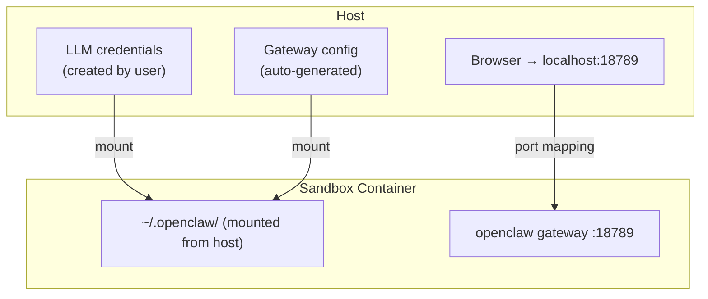

# Agent Guide

The agent commands (`agbox claude`, `agbox codex`, `agbox openclaw`, `agbox paseo`,
and `agbox agent --command "..."`) create a sandbox, install tools, and run an AI
agent in a single step. Each registered agent type has its own top-level command;
`agbox agent` itself is reserved exclusively for the `--command` custom-agent mode.

**Workspace**: the current directory (or `--workspace` path) is copied into
`/workspace` inside the container. Changes inside the sandbox do **not** affect
your host filesystem. If the workspace is not a Git repository, you are prompted
to confirm before copying.

## Overview

| Agent Type | Mode | What it does |
|-----------|------|-------------|
| `claude` | interactive | Launches Claude Code with a TTY — type prompts, see responses in real time |
| `codex` | interactive | Launches Codex CLI with a TTY |
| `openclaw` | long-running | Deploys an OpenClaw gateway accessible via browser |
| `paseo` | long-running | Deploys a Paseo daemon inside a sandbox |
| `--command` | interactive (default) | Runs any custom command inside a sandbox |

## Claude / Codex

Claude and Codex share identical workflow — only the CLI binary differs.

```bash
# Basic usage
agbox claude
agbox codex

# Use a specific project directory
agbox claude --workspace /path/to/project

# Override builtin tools (each sandbox image defines a default set)
agbox codex --builtin-tool claude --builtin-tool git
```

## OpenClaw

Deploys an [OpenClaw](https://docs.openclaw.ai) gateway inside a sandbox. Unlike
Claude/Codex, this is a long-running service — the sandbox persists after the CLI
exits.

The gateway runs as the container primary command (under tini) in a dedicated
`openclaw-runtime` image. The CLI creates the sandbox, waits for READY, then
detaches. The gateway may take a few seconds to accept traffic after READY.

### Prerequisites

Add LLM credentials to `~/.openclaw` on the host (mounted into the sandbox — see [Architecture](#architecture)):

```bash
# Codex OAuth (browser-based login)
OPENCLAW_STATE_DIR=~/.openclaw openclaw models auth login --provider openai-codex

# API key
OPENCLAW_STATE_DIR=~/.openclaw openclaw models auth add --provider openai --api-key <key>
```

### Deploy

```bash
agbox openclaw
```

The CLI creates a sandbox with the gateway as the container primary command and waits
for it to become READY.

### Access the Gateway

After deployment, the CLI prints a tokenized URL:

```
OpenClaw gateway is running.
  Gateway:    http://localhost:18789/#token=<auto-generated-token>
```

Open the URL in a browser — the token is auto-filled, click **Connect** to
enter the chat interface.

### Architecture



`agbox sandbox resume` restarts the container (and the gateway primary command restarts with it).
To force a full redeployment, delete and recreate:
`agbox sandbox delete <sandbox-id> && agbox openclaw`.

## Paseo

Deploys a [Paseo](https://paseo.sh) daemon inside a sandbox. Like OpenClaw,
this is a long-running service — the sandbox persists after the CLI exits.

```bash
agbox paseo
```

The paseo daemon starts as the container primary command. Three environment
variables are set by default to disable STT/TTS model downloads and
external skills.

To get the pairing URL:

```bash
agbox paseo url <sandbox-id>
```

### Builtin Tool Filtering

Paseo declares a broad set of builtin tools (`claude`, `codex`, `npm`, `uv`,
`apt`, `opencode`). During pre-flight, the CLI checks whether each tool's
required host paths exist. Tools whose required (non-optional) mounts are
missing are silently filtered out — a skip message is printed to stderr.
Tools with only optional mounts are never filtered.

## Custom Command

`agbox agent` is the only entry point for the custom-command mode; it requires
`--command` and does not accept a positional agent type (use `agbox claude` /
`agbox codex` / `agbox openclaw` / `agbox paseo` for those).

Run any command inside a sandbox:

```bash
# Interactive (default) — attaches a TTY, deletes sandbox on exit
agbox agent --command "aider --yes"

# With workspace and tools
agbox agent --command "aider" --workspace /path/to/project --builtin-tool git --builtin-tool uv

# Long-running — sandbox persists, stdout emits sandbox_id
SB_ID=$(agbox agent --command "my-agent" --mode long-running)
```

### Interactive vs Long-running

| Behavior | Interactive | Long-running |
|----------|------------|--------------|
| TTY | Attached — real-time input/output | No TTY — runs in background |
| Ctrl+C | Forwards signal, waits for exit, deletes sandbox | CLI detaches, sandbox keeps running |
| Sandbox lifecycle | Auto-deleted on exit | Persists until manual `stop`/`delete` |
| stdout | Streams through TTY | Prints sandbox ID only |

Default modes are shown in the [Overview table](#overview); override with `--mode`.
