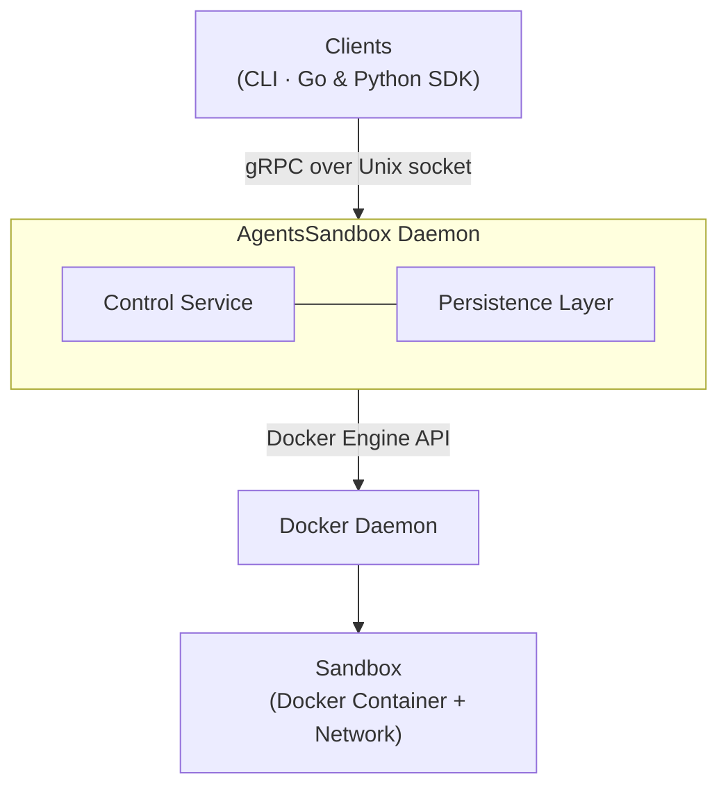

# Architecture Overview

`agents-sandbox` is a Docker-backed sandbox control plane. Each sandbox is a Docker container with a dedicated network. A local daemon manages sandbox lifecycle via gRPC over a Unix domain socket, with CLI, Go SDK, and Python SDK as client entry points.

## System Architecture

### Components

| Component | Role |
|-----------|------|
| **Clients** | CLI ([reference](cli_reference.md)), Go SDK ([usage](sdk_go_usage.md)), and Python SDK ([usage](sdk_python_usage.md)) — all talk to the daemon via gRPC over a Unix domain socket. |
| **AgentsSandbox Daemon** | Single-writer local process that serves gRPC, manages sandbox lifecycle, and coordinates async operations. See [Configuration Reference](configuration_reference.md). |
| **Sandbox** | A Docker container with a dedicated network, representing an isolated execution environment. See [Sandbox Container Lifecycle](sandbox_container_lifecycle.md). |
| **Control Service** | Core logic: request validation, state transitions, event ordering, restart recovery. See [Sandbox Container Lifecycle](sandbox_container_lifecycle.md). |
| **Persistence Layer** | bbolt-backed ID registry and event store for crash recovery. See [Daemon State Management](daemon_state_management.md). |
| **Docker Daemon** | Runtime backend for container, network, and exec operations. See [Container Dependency Strategy](container_dependency_strategy.md). |

### Request Flow

1. Client sends a gRPC request (create, stop, delete, exec, etc.).
2. Service validates input synchronously and returns an accepted handle.
3. Daemon converges asynchronously via Docker Engine API and emits ordered events.
4. Clients optionally wait by subscribing to the event stream. See [Protocol Design Principles](protocol_design_principles.md).

## Key Design Decisions

- **Accepted != completed** — slow operations return after acceptance, not completion. See [Protocol Design Principles](protocol_design_principles.md).
- **Exec output redirected to disk** — stdout/stderr go to bind-mounted host files, keeping output durable across daemon restarts. See [Sandbox Container Lifecycle](sandbox_container_lifecycle.md).
- **Historical IDs reserved persistently** — prevents accidental ID reuse after restart. See [Daemon State Management](daemon_state_management.md).
- **Single Docker Engine API client** — no CLI subprocess shelling. See [Container Dependency Strategy](container_dependency_strategy.md).
- **Filesystem ingress split by semantics** — `mounts`, `copies`, and `builtin_tools` have different security and lifecycle behavior. See [Container Dependency Strategy](container_dependency_strategy.md).
- **Per-sandbox network isolation** — each sandbox gets a dedicated Docker network; no cross-sandbox traffic, no host network, no Docker socket exposure. See [Isolation and Security](isolation_and_security.md).

## External Dependencies

- Docker Engine (container runtime)
- Go (daemon and SDK)
- Python + grpcio (Python SDK)
- Protobuf / gRPC (wire contract, see [Development Guide](development.md) for proto generation)
