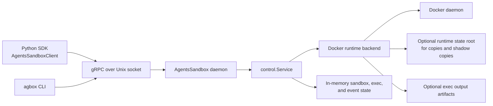

# Architecture Overview

`agents-sandbox` is a Docker-backed sandbox control plane with a local gRPC API and an async Python SDK. The repository contains the daemon, the runtime backend, the protobuf contract, the Python client layers, and a small example that exercises the public SDK surface.

## System Architecture

The system is organized around one local daemon process, one runtime backend, and two client layers.



### Main components

- `cmd/agboxd` starts the AgentsSandbox daemon, resolves config, derives the default socket path, acquires the single-host lock, and serves gRPC over a Unix domain socket.
- `internal/control.Service` owns request validation, accepted-state transitions, in-memory sandbox and exec records, event ordering, cursor generation, and async operation orchestration.
- `internal/control/docker_runtime.go` is the concrete runtime backend. It materializes filesystem inputs, creates Docker networks and containers, runs exec commands, and removes runtime-owned resources.
- `internal/profile` defines daemon-managed built-in resources such as `.claude`, `.codex`, `uv`, `npm`, `apt`, `gh-auth`, and `ssh-agent`.
- `api/proto/service.proto` is the transport contract shared by Go and Python.
- `sdk/python` contains a thin raw gRPC wrapper plus the public async `AgentsSandboxClient`, which adds `wait=True/False`, event-based waiting, cursor handling, and public handle models.

### Primary request and event flow

1. A client sends a gRPC request over the Unix socket.
2. The service performs synchronous fail-fast validation for create inputs, service declarations, builtin resource IDs, duplicate caller-provided IDs, and exec command shape.
3. `CreateSandbox`, `ResumeSandbox`, `StopSandbox`, `DeleteSandbox`, and `CreateExec` return as accepted operations while the daemon continues convergence asynchronously.
4. The runtime backend performs Docker-side work and reports results back to the service.
5. The service updates authoritative sandbox or exec state, appends ordered events with `cursor` and `sequence`, and exposes the latest snapshot through `GetSandbox` and `GetExec`.
6. The Python SDK optionally waits on top of that contract by combining an authoritative baseline read with `SubscribeSandboxEvents`.

## Core Capabilities And Usage Scenarios

### Sandbox lifecycle management

The daemon creates, resumes, stops, deletes, and lists sandboxes. Each sandbox gets:

- one primary container
- one dedicated Docker network
- zero or more service containers (required and optional)
- ordered lifecycle and exec events

This is the core path for products that need an isolated coding or execution environment with explicit lifecycle ownership.

### Command execution and direct output consumption

Exec creation is asynchronous at the protocol layer, but the result model now carries `stdout`, `stderr`, `exit_code`, and terminal state directly in `ExecStatus`. The public Python SDK exposes:

- `create_exec(..., wait=False)` for accepted async execution
- `create_exec(..., wait=True)` for event-driven waiting
- `run(...)` as the direct "wait for completion and read stdout" path

This supports both orchestration workflows and simple request-response command execution without relying on workspace result files.

### Filesystem ingress and built-in resources

Sandbox creation supports three public filesystem ingress modes:

- `mounts` for explicit bind mounts
- `copies` for daemon-owned copied content
- `builtin_resources` for daemon-defined resource shortcuts

These cover common scenarios such as:

- mounting a local project tree at `/workspace`
- copying seed files or fixture data into a sandbox
- exposing operator tooling such as `.claude`, `.codex`, `gh-auth`, `uv`, or `ssh-agent`

Services are declared explicitly as `required_services` or `optional_services` and become sibling containers on the sandbox network. Required services must be healthy before the primary is reported ready; optional services start in parallel and only emit warnings on failure. This supports cases such as adding a database or service sidecar next to the primary runtime image.

### Event subscription and replay

The daemon exposes a per-sandbox ordered event stream with:

- full replay from `from_cursor="0"`
- daemon-issued `cursor` values for incremental replay
- monotonic `sequence` numbers per sandbox
- optional current-state snapshots for active exec visibility

This supports long-running orchestration, reconnect after temporary client loss, and SDK-side waiting without pretending accepted operations are already complete.

## Technical Constraints And External Dependencies

### Runtime and deployment constraints

- The system is Docker-first. Runtime lifecycle, networking, container creation, and exec execution depend on a reachable Docker daemon.
- The daemon is a single-writer local control plane. It acquires an exclusive host lock at a hardcoded platform path and refuses to start if another daemon already owns that lock.
- gRPC transport is exposed over a Unix domain socket only, at a hardcoded platform-specific path (not configurable).
- The current service keeps sandbox records, exec records, and event history in memory. Event replay works for the daemon process lifetime, but a daemon restart resets replay history for active sandboxes.

### Filesystem and security constraints

- Unsafe or invalid create inputs are rejected at the RPC boundary instead of being accepted and failing later in the background.
- `mounts` and `copies` require absolute container targets and real host file or directory sources.
- `copies` and shadow-copy projections require `runtime.state_root` because the daemon materializes copied content into daemon-owned filesystem state.
- Runtime exec assumes a non-root sandbox user model. Writable paths must remain writable to that runtime user.
- Built-in resources are daemon-defined. Callers can select capability IDs but cannot replace them with arbitrary hidden host paths through the public SDK surface.

### External dependencies

- Go daemon and protocol implementation
- Docker CLI and Docker daemon interaction in the runtime backend
- gRPC and protobuf for the wire contract
- Python `grpcio` client stack and `uv`-managed SDK environment
- Optional host resources such as `SSH_AUTH_SOCK`, `~/.claude`, `~/.codex`, `~/.agents`, and local cache directories

## Important Design Decisions And Reasons

### Accepted operations stay distinct from completed state

Slow operations return after acceptance, not after completion. The service then exposes authoritative state through `GetSandbox` and `GetExec`, plus ordered events through `SubscribeSandboxEvents`. This keeps the protocol honest about asynchronous runtime work while still allowing the SDK to offer convenient waiting.

### The public Python SDK is direct-parameter, not request-wrapper driven

`AgentsSandboxClient()` now resolves the socket path internally and exposes direct-parameter `create_sandbox`, `create_exec`, and `run`. The protobuf request wrappers still exist internally for transport conversion, but they are no longer the preferred public northbound API. This keeps the SDK surface smaller and matches how callers actually use the service.

### Filesystem ingress is split by semantics

`mounts`, `copies`, and `builtin_resources` are separate concepts because they have different security and lifecycle behavior. A bind mount keeps a live host path, a copy materializes daemon-owned content, and a built-in resource is a daemon-defined shortcut with its own validation and resolution rules. Keeping them separate avoids stringly typed overloading and keeps fail-fast validation clear.

### Built-in resources remain daemon-owned capabilities

Capabilities such as `.claude`, `.codex`, `uv`, `npm`, and `ssh-agent` are resolved by the daemon, not by caller-supplied hidden path conventions. This keeps host-sensitive path logic centralized and lets the daemon decide when bind mounting is safe and when shadow-copy fallback is required.

### Exec output is part of the formal state model

`stdout` and `stderr` are carried directly in `ExecStatus` and in the public Python `ExecHandle`. Artifact files remain optional side effects for configured deployments, but they are no longer the only place where successful command output can be consumed. This makes `run(...)` and `wait=True` directly useful for ordinary SDK callers.

### Cleanup and ownership stay runtime-local

The daemon derives ownership from in-memory sandbox state plus namespaced Docker labels, and it removes primary containers, service containers (both required and optional), dedicated networks, and daemon-owned filesystem state during delete and failed create cleanup. This keeps runtime cleanup independent from any external product database.

## Proto Generation

Go and Python bindings are generated from `api/proto/service.proto` using pinned tool versions:

| Tool | Version |
|------|---------|
| protoc | v6.31.1 (release tag v31.1) |
| protoc-gen-go | v1.36.11 |
| protoc-gen-go-grpc | v1.6.1 |
| grpcio-tools | from `sdk/python` dev dependencies |

Regenerate bindings:

```bash
bash scripts/generate_proto.sh
```

The script downloads and caches protoc in `.local/protoc/` (project-local, git-ignored) and installs Go plugins in `.local/go-bin/`. CI runs `scripts/lints/check_proto_consistency.sh` automatically through `run_test.sh lint` to ensure checked-in bindings stay in sync with the proto source.

## Related Documents

- `README.md`
- `docs/sdk_async_usage.md`
- `docs/configuration_reference.md`
- `docs/sandbox_container_lifecycle.md`
- `docs/container_dependency_strategy.md`
- `docs/mount_and_copy_strategy.md`
