# Architecture Overview

`agents-sandbox` is a Docker-backed sandbox control plane with a local gRPC API, a layered Go SDK, an async Python SDK, and the AgentsSandbox CLI. The repository contains the daemon, the runtime backend, the protobuf contract, the Go and Python client layers, and a first-class local management CLI for sandbox lifecycle and exec operations.

## System Architecture

The system is organized around one local daemon process, one runtime backend, and multiple caller-facing entry points built on the same Unix-socket gRPC contract.

```mermaid
flowchart LR
    PySDK[Python SDK\nAgentsSandboxClient] --> RPC[gRPC over Unix socket]
    GoClient[Go SDK\nsdk/go/client] --> GoRaw[Go raw client\nsdk/go/rawclient]
    GoRaw --> RPC
    CLI[AgentsSandbox CLI\nversion/ping\nsandbox create&#124;list&#124;get&#124;delete&#124;exec] --> RPC
    RPC --> Daemon[AgentsSandbox daemon]
    Daemon --> Service[control.Service]
    Service --> Persistence[Persistent ids.db\nID registry + event store buckets]
    Service --> Runtime[Docker runtime backend]
    Runtime --> Docker[Docker daemon\nvia Engine API SDK]
    Service --> Memory[In-memory sandbox and exec state\nwith full restart recovery]
    Runtime --> StateRoot[Optional runtime state root\nfor copies and shadow copies]
    Runtime --> Artifacts[Optional exec output artifacts]
```



### Main components

- `cmd/agboxd` starts the AgentsSandbox daemon, resolves config, initializes structured JSON logging via Go stdlib `log/slog` (written to stderr for systemd/journald capture), acquires the single-host lock, creates the service plus its runtime closer chain, and serves gRPC over a Unix domain socket.
- `cmd/agbox` implements the local operator CLI. It resolves the daemon socket, talks to the gRPC API through `sdk/go/rawclient`, and exposes `version`, `ping`, and `sandbox` subcommands. The `sandbox` command currently supports `create`, `list`, `get`, `delete`, and `exec`, including label-based list/delete flows and JSON output for create/list/get.
- `internal/control.Service` owns request validation, accepted-state transitions, in-memory sandbox and exec records, event ordering, sequence generation, async operation orchestration, full restart recovery with Docker inspect-based reconciliation, and retention cleanup.
- `internal/control/id_registry.go` owns the shared bbolt-backed persistence bootstrap that opens `ids.db`, reserves caller-provided and daemon-generated `sandbox_id` / `exec_id` values across daemon restarts, and shares the database handle with the persistent event store.
- `internal/control/event_store.go` owns the event-store abstraction plus the persistent bbolt implementation used to replay sandbox history after daemon restart and to retain deleted sandbox streams until cleanup.
- `internal/control/docker_runtime.go` is the concrete runtime backend. It owns a long-lived Docker Engine API client, materializes filesystem inputs, creates Docker networks and containers, runs exec commands, and removes runtime-owned resources.
- `internal/profile` defines daemon-managed built-in resources. Tools (`claude`, `codex`, `git`, `uv`, `npm`, `apt`) are the user-facing names; each tool resolves to one or more named mounts (`.claude`, `.codex`, `.agents`, `gh-auth`, `ssh-agent`, `uv-cache`, `uv-data`, `npm`, `apt`). Multiple tools may share a mount; the daemon deduplicates by mount ID.
- `api/proto/service.proto` is the transport contract shared by the daemon, the Go SDK, and the Python SDK.
- `sdk/go/rawclient` contains the synchronous transport-facing Go client that resolves the default socket path, dials the Unix socket, wraps raw RPCs, translates typed gRPC errors, and exposes the raw event-stream primitive used by both the CLI and the high-level SDK.
- `sdk/go/client` contains the public high-level Go SDK. It converts protobuf payloads into public Go types, exposes direct-parameter lifecycle and exec APIs, adds `wait` behavior, and bridges sandbox events into Go channels.
- `sdk/python` contains a thin raw gRPC wrapper plus the public async `AgentsSandboxClient`, which adds `wait=True/False`, event-based waiting, sequence handling, and public handle models.

### Primary request and event flow

1. A client sends a gRPC request over the Unix socket.
2. The service performs synchronous fail-fast validation for create inputs, service declarations, builtin resource IDs, historical ID reuse, and exec command shape.
3. During `CreateSandbox` and `CreateExec`, the daemon reserves the final `sandbox_id` or `exec_id` in the persistent historical ID registry before accepting the request. When the caller omits an ID, the daemon generates and reserves a UUID v4 first.
4. `CreateSandbox`, `ResumeSandbox`, `StopSandbox`, `DeleteSandbox`, and `CreateExec` return as accepted operations while the daemon continues convergence asynchronously.
5. The runtime backend performs Docker-side work through a shared Docker Engine API client and reports results back to the service. Required services gate readiness; optional services start in parallel with the primary and report their initial success or failure asynchronously without blocking sandbox readiness.
6. The service persists ordered events and sandbox/exec configs before updating in-memory state, exposes their numeric ordering through event sequences, and performs full restart recovery by reconciling persisted state with Docker container inspect results after daemon restart.
7. The Go and Python high-level SDKs, along with the AgentsSandbox CLI `sandbox exec` command, optionally wait on top of that contract by combining an authoritative baseline read with `SubscribeSandboxEvents`, while `sdk/go/rawclient` keeps the transport contract visible without adding high-level wait semantics.

## Core Capabilities And Usage Scenarios

### Sandbox lifecycle management

The daemon creates, resumes, stops, deletes, and lists sandboxes. The AgentsSandbox CLI exposes that same lifecycle surface for local operators. Each sandbox gets:

- one primary container
- one dedicated Docker network
- zero or more service containers (required and optional)
- ordered lifecycle and exec events

This is the core path for products that need an isolated coding or execution environment with explicit lifecycle ownership.

The CLI is useful for:

- quick daemon reachability checks through `agbox ping`
- sandbox creation, inspection, and deletion through `agbox sandbox create|get|delete`
- label-based fleet operations through `agbox sandbox list` and `agbox sandbox delete --label`
- ad hoc command execution inside an existing sandbox through `agbox sandbox exec`

### Command execution and direct output consumption

Exec creation is asynchronous at the protocol layer. Exec stdout and stderr are redirected inside the container to bind-mounted host files, so the daemon is completely out of the I/O hot path and daemon restarts do not interrupt exec output. `CreateExecResponse` returns the host-side log file paths (`stdout_log_path`, `stderr_log_path`) so callers can read output independently. The public Go and Python SDKs expose the same lifecycle contract through language-appropriate APIs:

- `create_exec(..., wait=False)` for accepted async execution
- `create_exec(..., wait=True)` for event-driven waiting
- `run(...)` as the direct "wait for completion and read log files" path

The AgentsSandbox CLI `sandbox exec` command uses the same accepted-state plus event-stream contract to wait for terminal exec state and print command output directly to the terminal.

In Go, those calls live on `sdk/go/client`, while `sdk/go/rawclient` keeps the underlying accepted-state RPCs and raw event stream available to tools that want transport-level control. This supports both orchestration workflows and simple request-response command execution without relying on workspace result files.

### Filesystem ingress and built-in resources

Sandbox creation supports three public filesystem ingress modes:

- `mounts` for explicit bind mounts
- `copies` for daemon-owned copied content
- `builtin_tools` for daemon-defined resource shortcuts

These cover common scenarios such as:

- mounting a local project tree at `/workspace`
- copying seed files or fixture data into a sandbox
- exposing operator tooling such as `claude`, `codex`, `git`, or `uv`

Services are declared explicitly as `required_services` or `optional_services` and become sibling containers on the sandbox network. Required services must be healthy before the primary is reported ready; optional services start in parallel and report their initial ready or failed result through sandbox events without blocking the primary ready transition. This supports cases such as adding a database or service sidecar next to the primary runtime image.

### Event subscription and replay

The daemon exposes a per-sandbox ordered event stream with:

- full replay from `from_sequence=0`
- daemon-issued event sequence anchors for incremental replay
- monotonic `sequence` numbers per sandbox
- optional current-state snapshots for active exec visibility

Each `SandboxEvent` carries a `oneof details` field that is one of `SandboxPhaseDetails` (sandbox lifecycle transitions, errors, and stop reasons), `ExecEventDetails` (exec state and exit code), or `ServiceEventDetails` (service ready or failed). The top-level `sandbox_state` field reflects the sandbox state at the time the event was emitted, regardless of which details variant is set.

`CreateSandbox` returns `CreateSandboxResponse` containing a full `SandboxHandle` with the reserved `sandbox_id`, initial state, and the daemon-issued `last_event_sequence` cursor that seeds incremental event subscription without a snapshot/subscription race.

This supports long-running orchestration, reconnect after temporary client loss, and SDK-side waiting without pretending accepted operations are already complete.

### SDK layering and integration choices

The repository now exposes three caller integration styles:

- `sdk/go/rawclient` for transport-level Go integrations that want protobuf requests, direct RPC access, typed error translation, and manual event-stream control.
- `sdk/go/client` for most Go applications that want public Go types, direct-parameter methods, `wait` helpers, and channel-based event consumption.
- `sdk/python` for async Python applications that want the same lifecycle semantics with Python-native async iteration.

This separation keeps the wire contract stable while letting each language expose caller-friendly northbound APIs.

## Technical Constraints And External Dependencies

### Runtime and deployment constraints

- The system is Docker-first. Runtime lifecycle, networking, container creation, and exec execution depend on a reachable Docker daemon.
- The daemon is a single-writer local control plane. It acquires an exclusive host lock at a hardcoded platform path and refuses to start if another daemon already owns that lock.
- gRPC transport is exposed over a Unix domain socket only, at a hardcoded platform-specific path (not configurable).
- The current service still keeps sandbox and exec projections in memory, but event history is persisted in `ids.db` and replay survives daemon restart. See [`Daemon State Management`](daemon_state_management.md) for the full state classification, persistence rules, and restart recovery contract.
- A restarted daemon performs full state recovery by loading persisted sandbox/exec configs, replaying events, and reconciling with Docker container inspect results. Restored sandboxes support all operations (exec, stop, resume, delete) without restriction.
- Caller-visible ID uniqueness is stronger than in-memory lifecycle state: the daemon persists historical `sandbox_id` and `exec_id` reservations in a platform-derived `ids.db` file so old IDs remain unavailable after daemon restart.
- Runtime stop, delete, and failed-create cleanup do not reuse caller RPC contexts. The service and runtime switch to daemon-owned background contexts so cleanup can finish even if the initiating request has already ended.

### Filesystem and security constraints

- Unsafe or invalid create inputs are rejected at the RPC boundary instead of being accepted and failing later in the background.
- `mounts` and `copies` require absolute container targets and real host file or directory sources.
- `copies` and builtin-tool shadow copies require `runtime.state_root` because the daemon materializes copied content into daemon-owned filesystem state.
- Runtime exec assumes a non-root sandbox user model. Writable paths must remain writable to that runtime user.
- Built-in resources are daemon-defined. Callers can select capability IDs but cannot replace them with arbitrary hidden host paths through the public SDK surface.

### External dependencies

- Go daemon and protocol implementation (structured logging via stdlib `log/slog` with JSON output)
- Docker Engine API Go SDK and a reachable Docker daemon
- gRPC and protobuf for the wire contract
- Go gRPC client stack for `sdk/go/rawclient` and `sdk/go/client`
- Python `grpcio` client stack and `uv`-managed SDK environment
- Optional host resources such as `SSH_AUTH_SOCK`, `~/.claude`, `~/.codex`, `~/.agents`, `~/.cache/uv`, `~/.local/share/uv`, and local cache directories

## Important Design Decisions And Reasons

### Accepted operations stay distinct from completed state

Slow operations return after acceptance, not after completion. The service then exposes authoritative state through `GetSandbox` and `GetExec`, plus ordered events through `SubscribeSandboxEvents`. This keeps the protocol honest about asynchronous runtime work while still allowing the SDK to offer convenient waiting.

### Exec snapshots join the sandbox event stream atomically

Exec waits rely on sandbox events, so the protocol cannot ask SDKs to stitch an
exec snapshot to a sandbox stream with a sequence anchor borrowed from some later or
different read. `GetExec().exec.last_event_sequence` anchors the exec snapshot
to the same ordered sandbox event stream, which lets SDK wait paths subscribe
without a handoff race and without fallback polling.

### Historical IDs are reserved persistently, not only while a sandbox is live

Caller-provided `sandbox_id` and `exec_id` values are part of the external contract, so the daemon does not treat them as temporary in-memory handles. It reserves them in a persistent registry before accepting create operations, which prevents accidental ID reuse after daemon restart and keeps conflict detection independent from Docker object discovery or any external product database.

### Docker access stays on one structured client path

The runtime backend uses a single Docker Engine API client per service instance instead of spawning Docker CLI subprocesses for inspect, lifecycle, image, or exec work. This keeps Docker interactions on structured API surfaces, removes text-parsing dependencies, and makes shutdown explicit because the runtime client is returned as part of the daemon's closer chain.

### The Go SDK is explicitly split into raw and high-level layers

`sdk/go/rawclient` owns socket resolution, dialing, raw RPC calls, error translation, and raw event streams. `sdk/go/client` owns public Go types, `wait` defaults, sequence-based wait paths, and channel-based subscription. Keeping those concerns separate lets transport-aware tools stay close to protobuf while ordinary Go callers get a smaller, more idiomatic API.

### The public SDKs are direct-parameter, not request-wrapper driven

`sdk/go/client.New()` and Python `AgentsSandboxClient()` both resolve the socket path internally and expose direct-parameter lifecycle and exec methods. Protobuf request wrappers still exist at the transport layer, but they are no longer the preferred public northbound API for ordinary callers. This keeps the high-level SDK surfaces smaller and matches how callers actually use the service.

### Filesystem ingress is split by semantics

`mounts`, `copies`, and `builtin_tools` are separate concepts because they have different security and lifecycle behavior. A bind mount keeps a live host path, a copy materializes daemon-owned content, and a built-in resource is a daemon-defined shortcut with its own validation and resolution rules. Keeping them separate avoids stringly typed overloading and keeps fail-fast validation clear.

### Built-in resources remain daemon-owned capabilities

Tool names such as `claude`, `codex`, `git`, `uv`, and `npm` are resolved by the daemon into their underlying mounts, not by caller-supplied hidden path conventions. This keeps host-sensitive path logic centralized and lets the daemon decide when bind mounting is safe and when shadow-copy fallback is required. Multiple tools may share a mount; the daemon deduplicates by mount ID before materializing.

### Exec output is redirected to disk inside the container

Exec stdout and stderr are redirected inside the container to bind-mounted host files (`{ArtifactOutputRoot}/{sandbox_id}/{exec_id}.stdout.log` / `.stderr.log`). The daemon does not attach to exec output streams and carries zero I/O buffer per exec. `CreateExecResponse` returns the host-side log paths so SDK callers can read output independently. This design keeps exec output durable across daemon restarts.

### Cleanup and ownership stay runtime-local

The daemon derives ownership from in-memory sandbox state plus namespaced Docker labels, and it removes primary containers, service containers (both required and optional), dedicated networks, and daemon-owned filesystem state during delete and failed create cleanup. Cleanup runs on daemon-owned contexts instead of request-scoped cancellation, which keeps teardown reliable after accepted async operations and failed materialization paths.

## Proto Generation

Go and Python bindings are generated from `api/proto/service.proto` using pinned tool versions:

| Tool | Version |
|------|---------|
| protoc | v6.31.1 (release tag v31.1) |
| protoc-gen-go | v1.36.11 |
| protoc-gen-go-grpc | v1.6.1 |
| grpcio-tools | from `sdk/python` dev dependencies |

Regenerate bindings:

```bash
bash scripts/generate_proto.sh
```

The script downloads and caches protoc in `.local/protoc/` (project-local, git-ignored) and installs Go plugins in `.local/go-bin/`. CI runs `scripts/lints/check_proto_consistency.sh` automatically through `run_test.sh lint` to ensure checked-in bindings stay in sync with the proto source.

## Related Documents

- `README.md`
- `docs/sdk_go_usage.md`
- `docs/sdk_async_usage.md`
- `docs/configuration_reference.md`
- `docs/sandbox_container_lifecycle.md`
- `docs/container_dependency_strategy.md`
- `docs/mount_and_copy_strategy.md`
- `docs/declarative_yaml_config.md`
