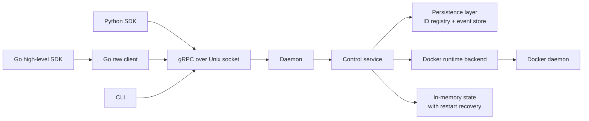

# Architecture Overview

`agents-sandbox` is a Docker-backed sandbox control plane with a local gRPC API, a layered Go SDK, an async Python SDK, and the AgentsSandbox CLI.

## System Architecture

The system is organized around one local daemon process, one runtime backend, and multiple caller-facing entry points built on the same Unix-socket gRPC contract.

### Main components

- **Daemon** — resolves config, initializes structured JSON logging (stderr for systemd/journald), acquires the single-host lock, and serves gRPC over a Unix domain socket.
- **CLI** — local operator interface that talks to the daemon via gRPC. Exposes sandbox lifecycle subcommands (`create`, `list`, `get`, `delete`, `exec`), label-based fleet operations, and JSON output. The `agbox agent` subcommand launches interactive agent sessions (pre-registered tools like `agbox agent claude` or custom commands via `agbox agent --command "..."`) by creating a sandbox via gRPC and then calling `docker exec -it` directly to attach a TTY; see [Container Dependency Strategy](container_dependency_strategy.md) for details.
- **Control service** — core business logic: request validation, accepted-state transitions, in-memory sandbox/exec records, event ordering and sequence generation, async operation orchestration, restart recovery with Docker inspect reconciliation, and retention cleanup.
- **Persistence layer** — bbolt-backed ID registry (reserves `sandbox_id`/`exec_id` across restarts) and event store (replays sandbox history after restart, retains deleted streams until cleanup).
- **Docker runtime backend** — single Docker Engine API client owning filesystem ingress materialization, network/container creation, exec commands, and resource removal.
- **Built-in resource profiles** — daemon-managed tool definitions (`claude`, `codex`, `git`, `uv`, `npm`, `apt`) that resolve to named mounts; multiple tools may share a mount, deduplicated by mount ID.
- **Protobuf contract** — `api/proto/service.proto` is the transport contract shared by the daemon, Go SDK, and Python SDK. See [Development Guide](development.md) for proto generation.
- **Go SDK** — two layers: a raw transport client (socket resolution, raw RPCs, typed error translation, raw event-stream) and a high-level client (public Go types, direct-parameter APIs, wait behavior, channel-based event consumption).
- **Python SDK** — public async `AgentsSandboxClient` with `wait=True/False`, event-based waiting, sequence handling, and public handle models.

### Primary request and event flow

1. A client sends a gRPC request over the Unix socket.
2. The service performs synchronous fail-fast validation for create inputs, service declarations, builtin resource IDs, historical ID reuse, and exec command shape.
3. During `CreateSandbox` and `CreateExec`, the daemon reserves the final ID in the persistent historical ID registry before accepting the request. When the caller omits an ID, the daemon generates and reserves a UUID v4 first.
4. `CreateSandbox`, `ResumeSandbox`, `StopSandbox`, `DeleteSandbox`, and `CreateExec` return as accepted operations while the daemon continues convergence asynchronously.
5. The runtime backend performs Docker-side work and reports results back to the service. Required services gate readiness; optional services start in parallel and report asynchronously without blocking sandbox readiness.
6. The service persists ordered events and configs before updating in-memory state, exposes numeric ordering through event sequences, and performs full restart recovery by reconciling persisted state with Docker inspect results.
7. The high-level SDKs and CLI optionally wait by combining an authoritative baseline read with `SubscribeSandboxEvents`.

## Core Capabilities and Usage Scenarios

### Sandbox lifecycle management

Each sandbox gets one primary container, one dedicated Docker network, zero or more service containers (required and optional), and ordered lifecycle and exec events. The CLI supports daemon reachability checks, sandbox creation/inspection/deletion, label-based fleet operations, and ad hoc command execution.

### Command execution and direct output consumption

Exec creation is asynchronous at the protocol layer. Exec stdout and stderr are redirected inside the container to bind-mounted host files, so the daemon is out of the I/O hot path and daemon restarts do not interrupt exec output. The response returns host-side log file paths so callers can read output independently. The public SDKs expose `create_exec(wait=False)` for accepted async execution, `create_exec(wait=True)` for event-driven waiting, and `run(...)` as the direct "wait for completion and read log files" path.

### Filesystem ingress and built-in resources

Sandbox creation supports three public filesystem ingress modes: `mounts` (explicit bind mounts), `copies` (daemon-owned copied content), and `builtin_tools` (daemon-defined resource shortcuts). Services are declared as `required_services` or `optional_services` and become sibling containers on the sandbox network. See [Container Dependency Strategy](container_dependency_strategy.md) for details.

### Event subscription and replay

The daemon exposes a per-sandbox ordered event stream with full replay, daemon-issued sequence anchors for incremental replay, and monotonic `sequence` numbers per sandbox. Each event carries typed details (sandbox phase, exec, or service). `CreateSandbox` returns a handle with a daemon-issued `last_event_sequence` cursor that seeds incremental subscription without a snapshot/subscription race.

### SDK layering and integration choices

The repository exposes three integration styles: a raw transport Go client, a high-level Go client, and an async Python client. Both high-level clients resolve the socket path internally and expose direct-parameter lifecycle and exec methods. Protobuf request wrappers exist at the transport layer but are not the preferred public API.

## Technical Constraints and External Dependencies

### Runtime and deployment constraints

- Docker-first: runtime lifecycle, networking, container creation, and exec execution depend on a reachable Docker daemon.
- Single-writer local control plane: the daemon acquires an exclusive host lock, refusing to start if another daemon already owns it.
- gRPC transport over Unix domain socket only, at a hardcoded platform-specific path.
- Sandbox and exec projections are in-memory, but event history is persisted and replay survives daemon restart. See [Daemon State Management](daemon_state_management.md) for details.
- A restarted daemon performs full state recovery by loading persisted configs, replaying events, and reconciling with Docker inspect results.
- Historical ID reservations persist across restarts so old IDs remain unavailable.
- Stop, delete, and failed-create cleanup use daemon-owned background contexts so cleanup finishes even if the initiating request has ended.

### Filesystem and security constraints

- Unsafe or invalid create inputs are rejected at the RPC boundary instead of accepted and failing later in the background.
- `mounts` and `copies` require absolute container targets and real host sources.
- `copies` and builtin-tool shadow copies require a configured state root because the daemon materializes content into daemon-owned filesystem state.
- Runtime exec assumes a non-root sandbox user model.
- Built-in resources are daemon-defined; callers cannot replace them with arbitrary host paths.

### External dependencies

- Go runtime with structured JSON logging
- Docker Engine API and a reachable Docker daemon
- gRPC and protobuf for the wire contract
- Python `grpcio` client stack and `uv`-managed SDK environment

## Important Design Decisions and Reasons

- **Accepted operations stay distinct from completed state.** Slow operations return after acceptance, not after completion. See [Protocol Design Principles](protocol_design_principles.md).
- **Exec snapshots join the sandbox event stream atomically.** The exec handle's `last_event_sequence` anchors exec snapshots to the sandbox event stream, eliminating handoff races. See [Protocol Design Principles](protocol_design_principles.md).
- **Historical IDs are reserved persistently.** IDs are reserved in a persistent registry before accepting create operations, preventing accidental reuse after daemon restart. See [Sandbox Container Lifecycle](sandbox_container_lifecycle.md).
- **Docker access stays on one structured client path.** The runtime backend uses a single Docker Engine API client instead of CLI subprocesses. See [Container Dependency Strategy](container_dependency_strategy.md).
- **The Go SDK is explicitly split into raw and high-level layers.** The raw layer owns transport concerns; the high-level layer owns public types and wait behavior.
- **The public SDKs are direct-parameter, not request-wrapper driven.** Both SDKs resolve the socket path internally and expose direct-parameter methods.
- **Filesystem ingress is split by semantics.** `mounts`, `copies`, and `builtin_tools` have different security and lifecycle behavior. See [Container Dependency Strategy](container_dependency_strategy.md).
- **Exec output is redirected to disk inside the container.** Stdout/stderr go to bind-mounted host files, keeping output durable across daemon restarts. See [Sandbox Container Lifecycle](sandbox_container_lifecycle.md).
- **Cleanup and ownership stay runtime-local.** The daemon derives ownership from in-memory state plus namespaced Docker labels. See [Container Dependency Strategy](container_dependency_strategy.md).
- **Cleanup and retention are bounded by TTL.** STOPPED sandboxes are automatically deleted after `runtime.cleanup_ttl` elapses; deleted sandbox event streams remain queryable until `runtime.cleanup_ttl` expires. See [Sandbox Container Lifecycle](sandbox_container_lifecycle.md).
