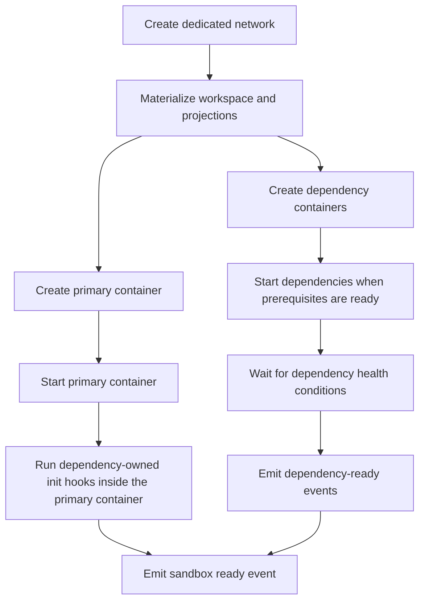

# Container Dependency Strategy

This document defines how `agents-sandbox` handles projections, dependencies, permissions, and network isolation.

The goal is a portable Docker-first runtime with a strict default security posture and no hidden product-specific branches.

## Core Rules

- Each sandbox gets its own dedicated Docker network.
- The primary container and all declared dependencies attach only to that sandbox network.
- Host network, shared bridge reuse, and Docker socket exposure to runtime containers are not supported.
- Only explicitly declared workspace and capability projections may enter the sandbox.
- Invalid or unsafe runtime inputs must fail fast. The daemon must not silently widen mounts or fall back to weaker isolation.

## Projection Classes

Projection intent is split into two independent classes and must not be merged into a single generic mount bucket.

| Class | Purpose | Examples | Default Behavior |
|-------|---------|----------|------------------|
| Cache projections | Reuse package and tool caches to avoid repeated downloads | `uv`, `npm`, `apt` | Enabled by daemon defaults and may be disabled per sandbox |
| Tooling projections | Provide agent and operator capabilities | `.claude`, `.codex`, `.agents`, `gh-auth`, `ssh-agent` | Disabled unless the caller explicitly requests the capability |

## Built-in Tooling Projections

| Capability ID | Default Host Source | Default Container Target | Mode |
|---------------|---------------------|--------------------------|------|
| `.claude` | `~/.claude` | `/home/sandbox/.claude` | read-write |
| `.codex` | `~/.codex` | `/home/sandbox/.codex` | read-write |
| `.agents` | `~/.agents` | `/home/sandbox/.agents` | read-write |
| `gh-auth` | `~/.config/gh` | `/home/sandbox/.config/gh` | read-only |
| `ssh-agent` | `SSH_AUTH_SOCK` from the host environment | `/ssh-agent` | socket forwarding |

These are daemon-defined capabilities. Requests may select from this set but may not replace them with arbitrary host paths.

## Workspace Materialization and Symlinks

The workspace and projection layers follow different symlink rules.

### Workspace materialization

`WorkspaceMaterializationSpec(mode=durable_copy)` preserves the current durable-copy behavior:

- symlinks that stay inside the declared project root are preserved
- symlinks that escape the declared project root are rejected
- dangling or unreadable links are rejected

### Projection materialization

`CapabilityProjectionSpec` must preflight symlink targets before bind mounting:

- if a target stays inside the same projection root, bind mounting is allowed
- if a target stays inside another explicitly declared projection root, bind mounting is allowed
- if a target escapes every declared projection root, the daemon must not auto-mount the escaped host path

Escaping projection targets must take one of two outcomes:

- `shadow_copy` into daemon-owned runtime state, then project the shadow tree into the sandbox
- explicit failure if `shadow_copy` cannot be completed safely

For writable projections that fall back to `shadow_copy`, writes stay inside the shadow tree and do not write back to the original escaped target.

The daemon must expose the resolved result through `ResolvedProjectionHandle`, including whether the projection uses `bind` or `shadow_copy` and whether write-back remains enabled.

## Dependency Model

Dependencies are declared explicitly through `DependencySpec`.

| Field Area | Required Semantics |
|------------|--------------------|
| Identity | Each dependency has a stable dependency name inside the sandbox |
| Image and env | Defined explicitly by the caller or profile |
| Network alias | Scoped to the sandbox's dedicated network |
| Health contract | The daemon waits for declared readiness conditions before reporting the sandbox ready |
| Lifecycle ownership | Dependencies are created, stopped, and deleted with the sandbox |
| Init hooks | Dependency-owned init hooks may run inside the primary container after the dependency is ready |

Dependencies are generic runtime features. Product-specific config formats that map into these fields stay outside this repository.

## Startup Strategy

Startup rules:

- Dependencies may start in parallel once the required network and projections are ready.
- Parallel startup is a performance optimization only; it must not weaken isolation or readiness checks.
- Init hooks run only after their owner dependency is ready and the primary container is running.
- A failing dependency or failing init hook fails the whole materialization path and triggers cleanup of newly created runtime resources.

## Permissions and Runtime User Model

The runtime must execute under a non-root user inside the sandbox.

Required rules:

- Images may be built as root, but runtime command execution must happen as a non-root sandbox user.
- Bind-mounted writable paths must remain writable to that runtime user.
- The daemon must not rely on root-only behavior for normal exec, lifecycle, or dependency orchestration.

## Cleanup and Ownership

`agents-sandbox` owns cleanup for runtime resources in its namespace:

- primary containers
- dependency containers
- dedicated networks
- runtime-owned shadow-copy trees
- runtime-owned event and artifact files

The daemon must not require an external product database snapshot to decide whether a dependency or network belongs to a live sandbox. Ownership must be derivable from runtime state plus namespaced labels.

