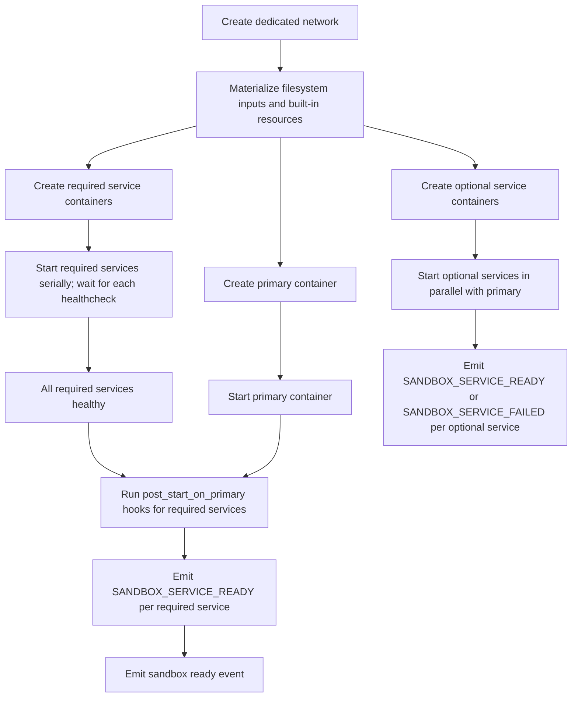

# Container Dependency Strategy

This document defines how `agents-sandbox` materializes everything inside and around the sandbox container before it becomes READY: filesystem ingress, built-in resources, services, permissions, network isolation, and cleanup.

## Core Rules

- Each sandbox gets its own dedicated Docker network. Host network, shared bridge reuse, and Docker socket exposure are not supported.
- Only explicitly declared filesystem inputs may enter the sandbox. Invalid or unsafe inputs must fail fast.
- Runtime orchestration uses structured Docker Engine API calls through the daemon's shared runtime client instead of Docker CLI subprocesses. This keeps interactions on typed API surfaces and removes text-parsing dependencies.

## Filesystem Ingress Classes

The public surface supports three distinct ingress classes. `mounts`, `copies`, and `builtin_tools` are separate concepts because they have different security and lifecycle behavior: a bind mount keeps a live host path, a copy materializes daemon-owned content, and a built-in resource is a daemon-defined shortcut with its own validation and resolution rules.

| Class | Purpose | Default |
|-------|---------|---------|
| `mounts` | Bind explicit host paths into the sandbox | Disabled unless caller declares each mount |
| `copies` | Copy host files/trees into daemon-owned state | Disabled unless caller declares each copy |
| `builtin_tools` | Daemon-defined resource shortcuts | Disabled unless caller requests each resource |

Mount and copy must not be implicitly converted into each other. Mounts and copies require absolute container targets and real host file or directory sources. Conflicting targets must fail fast.

## Built-in Tooling Projections

The imported session/auth runtime uses `/home/agbox` as its effective `HOME`, so the default container targets are aligned with that path.

Tools are the user-facing names passed in `builtin_tools`. Each tool resolves to one or more named mounts; multiple tools may share a mount and the daemon deduplicates by mount ID before materializing.

| Tool | Resolved Mounts (Host Source → Container Target, Mode) |
|------|--------------------------------------------------------|
| `claude` | `~/.claude` → `/home/agbox/.claude` (rw), `~/.claude.json` → `/home/agbox/.claude.json` (rw) |
| `codex` | `~/.codex` → `/home/agbox/.codex` (rw), `~/.agents` → `/home/agbox/.agents` (rw) |
| `git` | `SSH_AUTH_SOCK` → `/ssh-agent` (socket forwarding), `~/.config/gh` → `/home/agbox/.config/gh` (read-only) |
| `uv` | `~/.cache/uv` → `/home/agbox/.cache/uv` (rw), `~/.local/share/uv` → `/home/agbox/.local/share/uv` (rw) |
| `npm` | `~/.npm` → `/home/agbox/.npm` (read-write) |
| `apt` | `~/.cache/agents-sandbox-apt` → `/var/cache/apt/archives` (read-write) |

Notes:
- `codex` mounts both `~/.codex` and `~/.agents`; `~/.agents` is the shared agents state directory.
- `git` bundles SSH agent forwarding and GitHub CLI auth; requesting `git` is equivalent to requesting both.
- `uv` mounts both the package cache and the data directory holding Python interpreters and globally installed tools.

These are daemon-defined capabilities. Callers may select from this set but may not replace them with arbitrary host paths. The minimal base runtime image asset is under `images/base-runtime/`; the HOME-aligned coding runtime image is under `images/coding-runtime/`.

When an imported runtime image needs host-backed authentication material, `HOST_UID` and `HOST_GID` let the entrypoint create or reuse a non-root runtime user whose file ownership matches the host identity. The container `HOME` must match the built-in resource target path (`/home/agbox`).

## Copy Exclude Patterns and Symlink Handling

### Generic mounts

- The mount source must be a real file or directory, not a symlink.
- If the mount cannot be provided safely, the daemon fails fast.
- The daemon does not silently rewrite a mount into a copy.

### Generic copies

- The copy source must be a real file or directory, not a symlink.
- `exclude_patterns` are applied while populating the copied tree (see [Declarative YAML Config](declarative_yaml_config.md) for the YAML field reference).
- Project-internal symlinks are preserved as symlinks; absolute host paths are rewritten to relative targets when needed.
- Project-external or unreadable symlink targets are rejected instead of being auto-imported.

### Built-in resources

- Regular directories use bind mounts when safe.
- Directory trees with escaping symlinks fall back to daemon-owned shadow copies.
- Socket resources such as `ssh-agent` are forwarded only when the host path is a real Unix socket.

## Service Model

Services are declared through `ServiceSpec` and split into `required_services` and `optional_services`.

`ServiceSpec` fields: `name` (stable service name, also used as `network_alias`), `image`, `envs`, `healthcheck`, `post_start_on_primary` (hook commands on primary after service becomes healthy).

| Category | Startup | Failure |
|----------|---------|---------|
| `required_services` | Must be healthy before primary is READY | Fails entire sandbox materialization |
| `optional_services` | Started in parallel with primary | Emits `SANDBOX_SERVICE_FAILED` for initial attempt only; not restarted in V1 |

## Startup Strategy

Startup rules:
- `post_start_on_primary` is valid only for `required_services`; `optional_services` must reject it during synchronous validation.
- Parallel startup of optional services must not weaken isolation or readiness checks for required services.
- Service startup, health inspection, and hook execution must stay on structured Docker API paths.

## Permissions and Runtime User Model

The runtime must execute under a non-root user inside the sandbox. Bind-mounted writable paths must remain writable to that runtime user. The daemon must not rely on root-only behavior for normal exec, lifecycle, or service orchestration.

## Cleanup and Ownership

`agents-sandbox` owns cleanup for resources carrying the `io.github.1996fanrui.agents-sandbox.*` label namespace: primary containers, service containers, dedicated networks, shadow-copy trees, and event/artifact files.

Docker objects without these labels are never inspected, stopped, or removed by the daemon. Ownership must be derivable from runtime state plus namespaced labels without requiring an external product database snapshot. Cleanup continues on daemon-owned contexts rather than request-scoped cancellation.

## Architectural Exception: `agbox agent`

The rule that all Docker access goes through the daemon's structured runtime client has one deliberate exception: `agbox agent`.

This subcommand creates a sandbox via gRPC, waits for it to become READY, then calls `docker exec -it` directly from the CLI process to attach an interactive TTY session into the primary container. On exit, the sandbox is deleted via gRPC.

Two modes are supported:
- **Pre-registered tool:** `agbox agent claude`, `agbox agent codex` — uses built-in command and builtin-tool defaults from the agent tool registry.
- **Custom command:** `agbox agent --command "aider --yes" --mount /path/to/aider:/usr/local/bin/aider` — user provides the full command and mounts the tool binary into the container.

**Why this is necessary:**

The daemon's exec model is designed for non-interactive batch execution. Adding interactive TTY support at the daemon protocol layer would require gRPC bidirectional streaming plus in-daemon PTY management — significant complexity with little benefit beyond this subcommand. Calling `docker exec -it` directly from the CLI is simpler, keeps the daemon out of the TTY path, and is equivalent to what a user would do manually.

**Known constraint:** The CLI's `docker exec` call and the daemon's Docker Engine API calls must target the same Docker daemon. If `DOCKER_HOST` or `DOCKER_CONTEXT` differs between the environment where `agboxd` was started and the shell running `agbox agent`, the exec may land on the wrong target. This is rarely a problem when `agboxd` runs as a user process sharing the shell environment.

**Scope:** This exception is strictly limited to `agbox agent`. No other CLI commands bypass the daemon for Docker operations.
