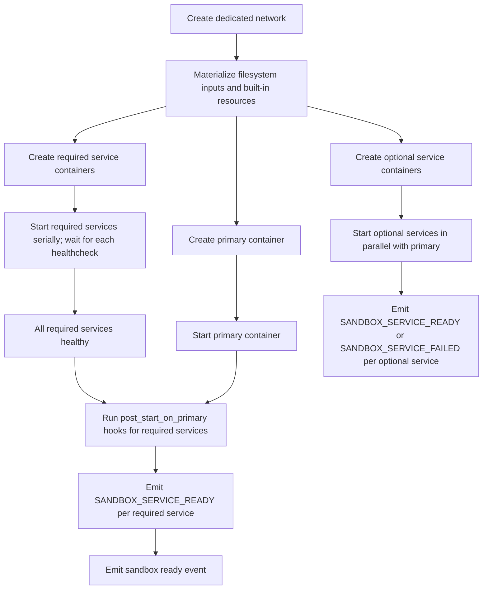

# Container Dependency Strategy

This document defines how `agents-sandbox` handles projections, services, permissions, and network isolation.

The goal is a portable Docker-first runtime with a strict default security posture and no hidden product-specific branches.

## Core Rules

- Each sandbox gets its own dedicated Docker network.
- The primary container and all declared services attach only to that sandbox network.
- Host network, shared bridge reuse, and Docker socket exposure to runtime containers are not supported.
- Only explicitly declared filesystem inputs may enter the sandbox.
- Invalid or unsafe runtime inputs must fail fast. The daemon must not silently widen mounts or fall back to weaker isolation.

## Filesystem Ingress Classes

The public northbound surface supports three distinct filesystem ingress classes:

| Class | Purpose | Examples | Default Behavior |
|-------|---------|----------|------------------|
| `mounts` | Bind explicit host paths into the sandbox | project tree, host config file, shared data directory | Disabled unless the caller explicitly declares each mount |
| `copies` | Copy explicit host files or trees into the sandbox | source snapshot, seed config, fixture data | Disabled unless the caller explicitly declares each copy |
| `builtin_resources` | Request daemon-defined resource shortcuts | `.claude`, `.codex`, `.agents`, `gh-auth`, `ssh-agent`, `uv`, `npm`, `apt` | Disabled unless the caller explicitly requests each resource |

## Built-in Tooling Projections

The imported session/auth runtime uses `/home/agbox` as its effective `HOME`, so the default container targets below are aligned with that path.

| Capability ID | Default Host Source | Default Container Target | Mode |
|---------------|---------------------|--------------------------|------|
| `.claude` | `~/.claude` | `/home/agbox/.claude` | read-write |
| `.codex` | `~/.codex` | `/home/agbox/.codex` | read-write |
| `.agents` | `~/.agents` | `/home/agbox/.agents` | read-write |
| `gh-auth` | `~/.config/gh` | `/home/agbox/.config/gh` | read-only |
| `ssh-agent` | `SSH_AUTH_SOCK` from the host environment | `/ssh-agent` | socket forwarding |
| `uv` | `~/.cache/uv` | `/home/agbox/.cache/uv` | read-write |
| `npm` | `~/.npm` | `/home/agbox/.npm` | read-write |
| `apt` | `~/.cache/agents-sandbox-apt` | `/var/cache/apt/archives` | read-write |

These are daemon-defined capabilities. Requests may select from this set but may not replace them with arbitrary host paths.

The minimal base runtime image asset is maintained under `images/base-runtime/`, and the HOME-aligned coding runtime image asset is maintained under `images/coding-runtime/`.

## Symlink Handling

The runtime applies different rules to different ingress modes.

### Generic mounts

`mounts` keep the original host tree shape:

- the mount source itself must be a real file or directory, not a symlink
- if the requested mount cannot be provided safely, the daemon fails fast
- the daemon does not silently rewrite a mount into a copy

### Generic copies

`copies` copy content into daemon-owned state before exposing it in the sandbox:

- the copy source itself must be a real file or directory, not a symlink
- exclude patterns are applied while populating the copied tree
- project-external or unreadable symlink targets are rejected instead of being auto-imported

### Built-in resources

`builtin_resources` resolve to daemon-defined host paths and targets:

- regular directories use bind mounts when safe
- directory trees that contain escaping symlinks fall back to daemon-owned shadow copies when supported
- socket resources such as `ssh-agent` are forwarded only when the host path is a real Unix socket

The daemon resolves each built-in resource internally, deciding whether to bind mount or shadow-copy based on the host path structure.

## Service Model

Services are declared explicitly through `ServiceSpec` and split into `required_services` and `optional_services`.

`ServiceSpec` fields:

| Field | Semantics |
|-------|-----------|
| `name` | Stable service name inside the sandbox; also used as the `network_alias` on the sandbox network |
| `image` | Container image, defined explicitly by the caller or profile |
| `environment` | Environment variables passed to the service container |
| `healthcheck` | Readiness condition used by the daemon to determine service health |
| `post_start_on_primary` | Hook commands to run inside the primary container after this service becomes healthy |

Service categories:

| Category | Startup Behavior | Failure Behavior |
|----------|-----------------|------------------|
| `required_services` | Must be healthy before the primary is reported ready | Failure fails the entire sandbox materialization |
| `optional_services` | Started in parallel with the primary container | Failure emits a warning only; daemon performs best-effort restart |

Services are generic runtime features. Product-specific config formats that map into these fields stay outside this repository.

## Startup Strategy

Startup rules:

- Required services must each pass their healthcheck before the primary is reported ready. A failing required service or failing `post_start_on_primary` hook fails the whole materialization path and triggers cleanup of newly created runtime resources.
- Optional services start in parallel with the primary container. A failing optional service emits `SANDBOX_SERVICE_FAILED` as a warning; the daemon performs best-effort restart but does not block sandbox readiness.
- `post_start_on_primary` hooks run only after their owner service is healthy and the primary container is running.
- Parallel startup of optional services is a performance optimization only; it must not weaken isolation or readiness checks for required services.

## Permissions and Runtime User Model

The runtime must execute under a non-root user inside the sandbox.

Required rules:

- Images may be built as root, but runtime command execution must happen as a non-root sandbox user.
- Bind-mounted writable paths must remain writable to that runtime user.
- The daemon must not rely on root-only behavior for normal exec, lifecycle, or service orchestration.

## Cleanup and Ownership

`agents-sandbox` owns cleanup for runtime resources that carry the `io.github.1996fanrui.agents-sandbox.*` label namespace:

- primary containers
- service containers (both required and optional)
- dedicated networks
- runtime-owned shadow-copy trees
- runtime-owned event and artifact files

Docker objects without these labels are never inspected, stopped, or removed by the daemon. This label-based boundary ensures user-created or third-party containers are not affected by daemon lifecycle operations.

The daemon must not require an external product database snapshot to decide whether a service container or network belongs to a live sandbox. Ownership must be derivable from runtime state plus namespaced labels.
