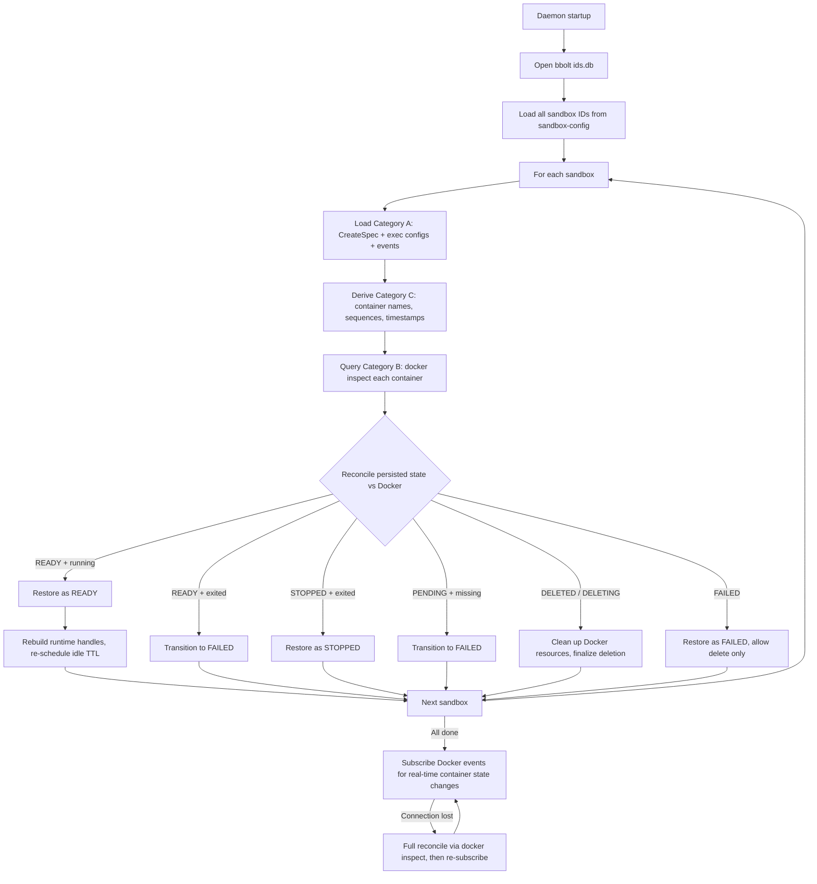

# Daemon State Management

This document defines the classification, persistence strategy, and recovery contract for every piece of state the daemon maintains. It is the authoritative reference for deciding where new state belongs and how it must behave across daemon restarts.

## Guiding Principle

> **Daemon restart must be transparent to callers**: all sandbox and exec state must be fully recoverable, and exec output logs must not be lost.

Every piece of daemon state must belong to exactly one category below. If a field exists only in memory and cannot be reconstructed from bbolt + Docker + filesystem, that is a bug.

| Category | Source of Truth | Persistence | Restart Recovery |
|----------|----------------|-------------|-----------------|
| A — bbolt-Persisted | bbolt (`ids.db`) | Write bbolt before accepting operation | Load from bbolt |
| B — Docker Runtime | Docker Engine API | Never persist | Query Docker via inspect |
| C — Derived / Rebuilt | Computed from A + B | No separate storage | Recompute on startup |
| D — Filesystem Artifacts | Host filesystem | Written during operation | Files already on disk |

## State Categories

### Category A — bbolt-Persisted State

Daemon-originated intent and history. Docker does not know about it; if lost, it is gone forever. Write to bbolt **before** accepting the operation or updating in-memory cache. On restart, load from bbolt.

| State | bbolt Bucket | Key | Value |
|-------|-------------|-----|-------|
| Sandbox ID reservation | `sandbox-ids` | sandbox_id | int64 (UnixNano) |
| Exec ID reservation | `exec-ids` | exec_id | int64 (UnixNano) |
| Event stream | `events:{sandbox_id}` | sequence (uint64) | `proto.Marshal(SandboxEvent)` |
| Deletion timestamp | `sandbox-deleted-at` | sandbox_id | int64 (UnixNano) |
| Sandbox config | `sandbox-config` | sandbox_id | `proto.Marshal(CreateSpec)` |
| Exec config | `exec-config:{sandbox_id}` | exec_id | `proto.Marshal(CreateExecRequest)` |

`sandbox-config` stores the final resolved `CreateSpec` after YAML parsing and parameter override merging. It contains all sandbox configuration: image, mounts, copies, builtin_tools, required_services, optional_services, and labels.

### Category B — Docker Runtime State

Actual condition of Docker containers, networks, and execs. Never write to bbolt (goes stale the moment the daemon stops observing). On restart, query Docker to rebuild.

| State | How to Obtain |
|-------|--------------|
| Container running/exited/OOM status | `docker inspect {container_name}` (container names from Category C) |
| Container exit code | `docker inspect {container_name}` |
| Service health status | `docker inspect {container_name}` → `.State.Health` |
| Network exists | `docker network inspect {network_name}` |

### Category C — Derived / Rebuilt State

Not persisted. Recomputed on startup from Category A and B. Includes both pure computations (container names) and runtime handles (cancel contexts, channels).

| State | Rebuilt From |
|-------|-------------|
| Network name | `agbox-net-{sanitize(sandbox_id)}` |
| Primary container name | `agbox-primary-{sanitize(sandbox_id)}` |
| Service container name | `agbox-svc-{sanitize(sandbox_id)}-{sanitize(service_name)}` (service names from `sandbox-config`) |
| Exec ID → Sandbox ID mapping | Enumerate `exec-config:{sandbox_id}` buckets |
| `deletedAtRecorded` flag | Presence check in `sandbox-deleted-at` |
| `lastTerminalRunFinishedAt` | Latest `EXEC_FINISHED` / `EXEC_CANCELLED` event timestamp in `events:{sandbox_id}` |
| `nextSequence` | `MaxSequence()` over `events:{sandbox_id}` |
| `context.CancelFunc` per exec | Create new cancel context for execs that Docker reports as still running |
| `optionalServiceStarts` channels | Re-inspect optional service containers; record final status directly |
| `sandboxRuntimeState` | Container names (deterministic) + runtime status from Docker |

### Category D — Host Filesystem Artifacts

Large or streaming output written directly to the host filesystem, outside bbolt. Survives daemon restart by design.

| Artifact | Host Path | Container Path |
|----------|-----------|----------------|
| Exec stdout log | `{ArtifactOutputRoot}/{sandbox_id}/{exec_id}.stdout.log` | `/var/log/agents-sandbox/{exec_id}.stdout.log` |
| Exec stderr log | `{ArtifactOutputRoot}/{sandbox_id}/{exec_id}.stderr.log` | `/var/log/agents-sandbox/{exec_id}.stderr.log` |

Default `ArtifactOutputRoot` on Linux: `~/.local/share/agents-sandbox/exec-logs/`

## Restart Recovery Contract

## bbolt Value Type Constraint

bbolt values only allow two types:

| Type | Encoding | Version Compatibility |
|------|----------|----------------------|
| Fixed-width integer | Big-endian `uint64` / `int64` (8 bytes) | Immutable — no compatibility concern |
| Protobuf message | `proto.Marshal(msg)` | Handled by proto3 forward/backward compatibility rules |

No strings, JSON, YAML, or custom binary formats in bbolt values. bbolt keys follow the same rule: either a fixed-width integer (sequence numbers) or a UTF-8 string identifier (sandbox_id, exec_id).

This constraint delegates all schema evolution to protobuf: adding fields, deprecating fields, and default values are all governed by proto3 semantics. The daemon code never needs custom migration logic.

## Version Compatibility

1. **New proto fields**: old daemons ignore unknown fields (proto3 forward-compatible). New daemons handle absent fields with zero-value defaults.
2. **New bbolt buckets**: new daemons create on first access. Old daemons never see it. No migration needed.
3. **Changing message semantics**: introduce a new `EventType` or new proto message rather than reusing old types with different meanings.
4. **Removing persisted state**: stop writing, keep reading logic for at least one release cycle to drain old data.

## Changelog

| Date | Change | Compatibility Notes |
|------|--------|-------------------|
| 2026-03-28 | Initial document | N/A |
