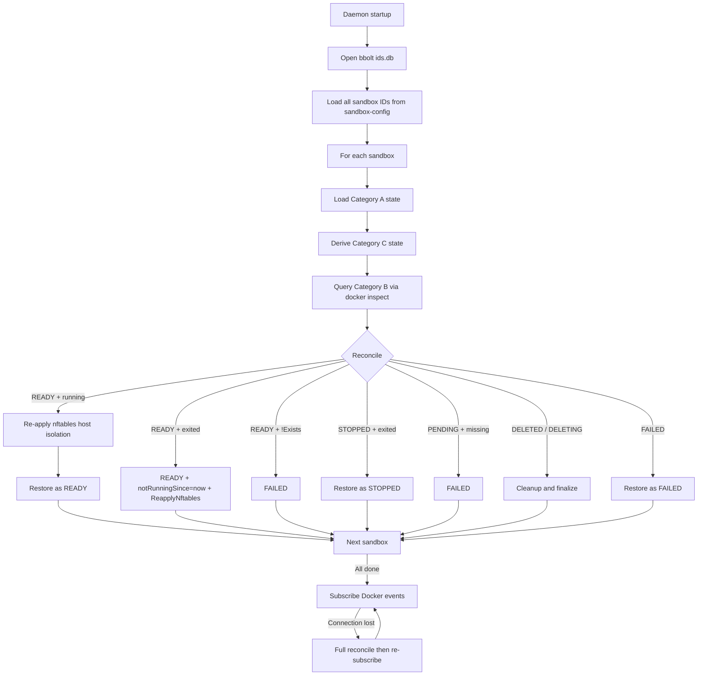

# Daemon State Management

This document defines the classification, persistence strategy, and recovery contract for every piece of state the daemon maintains. It is the authoritative reference for deciding where new state belongs and how it must behave across daemon restarts.

## Guiding Principle

> **Daemon restart must be transparent to callers**: all sandbox and exec state must be fully recoverable, and exec output logs must not be lost.

Every piece of daemon state must belong to exactly one category below. If a field exists only in memory and cannot be reconstructed from bbolt + Docker + filesystem, that is a bug.

One important nuance: some Category C fields are **allowed to reset on daemon restart** by design. Per-container crashloop timers (`notRunningSince`, `runningSince`) are Category C fields that intentionally reset on each daemon start — a restart is treated as a new grace period, equivalent to re-running reconcile from scratch. This is not a bug; it is the same philosophy as systemd and k8s restart budgets, which also reset on process restart. The key invariant is that the timers can always be reconstructed by re-observing Docker inspect state.

| Category | Source of Truth | Persistence | Restart Recovery |
|----------|----------------|-------------|-----------------|
| A — bbolt-Persisted | bbolt (`ids.db`) | Write before accepting operation | Load from bbolt |
| B — Docker Runtime | Docker Engine API | Never persist | Query Docker via inspect |
| C — Derived / Rebuilt | Computed from A + B | No separate storage | Recompute on startup |
| D — Filesystem Artifacts | Host filesystem | Written during operation | Files already on disk |

## Category A — bbolt-Persisted State

Daemon-originated intent and history. Write to bbolt **before** accepting the operation or updating in-memory cache.

| State | bbolt Bucket | Key | Value |
|-------|-------------|-----|-------|
| Sandbox ID reservation | `sandbox-ids` | sandbox_id | int64 (UnixNano) |
| Exec ID reservation | `exec-ids` | exec_id | int64 (UnixNano) |
| Event stream | `events:{sandbox_id}` | sequence (uint64) | `proto.Marshal(SandboxEvent)` |
| Deletion timestamp | `sandbox-deleted-at` | sandbox_id | int64 (UnixNano) |
| Sandbox config | `sandbox-config` | sandbox_id | `proto.Marshal(CreateSpec)` |
| Exec config | `exec-config:{sandbox_id}` | exec_id | `proto.Marshal(CreateExecRequest)` |

`sandbox-config` stores the final resolved `CreateSpec` after YAML parsing and parameter override merging.

## Category B — Docker Runtime State

Actual condition of Docker containers and networks. Never written to bbolt; obtained via `docker inspect` on restart.

| State | How to Obtain |
|-------|--------------|
| Container running/exited/OOM status | `docker inspect {container_name}` |
| Container exit code | `docker inspect {container_name}` |
| Companion container health status | `docker inspect {container_name}` → `.State.Health` |
| Network exists | `docker network inspect {network_name}` |
| nftables host isolation rule | Ephemeral kernel state (Linux only); re-applied on create, resume, and daemon restart recovery via `google/nftables` netlink library |

## Category C — Derived / Rebuilt State

Recomputed on startup from Category A and B.

| State | Rebuilt From |
|-------|-------------|
| Network name | `agbox-net-{sanitize(sandbox_id)}` |
| Primary container name | `agbox-primary-{sanitize(sandbox_id)}` |
| Companion container name | `agbox-companion-{sanitize(sandbox_id)}-{sanitize(name)}` |
| Exec ID → Sandbox ID mapping | Enumerate `exec-config:{sandbox_id}` buckets |
| `deletedAtRecorded` flag | Presence check in `sandbox-deleted-at` |
| `lastTerminalRunFinishedAt` | Latest terminal exec event timestamp; falls back to `createdAt` when no exec history exists |
| `nextSequence` | `MaxSequence()` over `events:{sandbox_id}` |
| `context.CancelFunc` per exec | New cancel context for running execs |
| `companionContainerStarts` channels | Re-inspect companion containers |
| `SandboxHandle.ErrorCode`, `ErrorMessage`, `StateChangedAt` | Last `SANDBOX_FAILED` event's `SandboxPhaseDetails` (error fields); last state-matching event's `OccurredAt` (timestamp) |
| `sandboxRuntimeState` | Container names + runtime status from Docker |
| `notRunningSince` (per primary / per companion) | Docker inspect observations accumulated since last Running or Paused state; reset on daemon restart (intentional — equivalent to a fresh grace period) |
| `runningSince` (per primary / per companion) | Docker inspect observations since container last entered Running; reset on daemon restart |

## Category D — Host Filesystem Artifacts

| Artifact | Host Path | Container Path |
|----------|-----------|----------------|
| Exec stdout log | `{ArtifactOutputRoot}/{sandbox_id}/{exec_id}.stdout.log` | `/var/log/agents-sandbox/{exec_id}.stdout.log` |
| Exec stderr log | `{ArtifactOutputRoot}/{sandbox_id}/{exec_id}.stderr.log` | `/var/log/agents-sandbox/{exec_id}.stderr.log` |

Default `ArtifactOutputRoot` on Linux: `~/.local/share/agents-sandbox/exec-logs/`

## Restart Recovery Contract

After all sandboxes are recovered, the daemon subscribes to Docker events for real-time container state changes. On connection loss, it performs a full reconcile via docker inspect then re-subscribes.

## bbolt Value Type Constraint

| Type | Encoding | Version Compatibility |
|------|----------|----------------------|
| Fixed-width integer | Big-endian `uint64`/`int64` (8 bytes) | Immutable |
| Protobuf message | `proto.Marshal(msg)` | proto3 forward/backward compatible |

No strings, JSON, YAML, or custom binary formats in bbolt values. Keys follow the same rule: either fixed-width integer (sequence numbers) or UTF-8 string identifier. This delegates all schema evolution to protobuf.

## Version Compatibility

1. **New proto fields**: proto3 forward-compatible; new daemons handle absent fields with zero-value defaults.
2. **New bbolt buckets**: created on first access; no migration needed.
3. **Changing message semantics**: introduce new `EventType` or proto message.
4. **Removing persisted state**: stop writing, keep reading logic for at least one release cycle.
