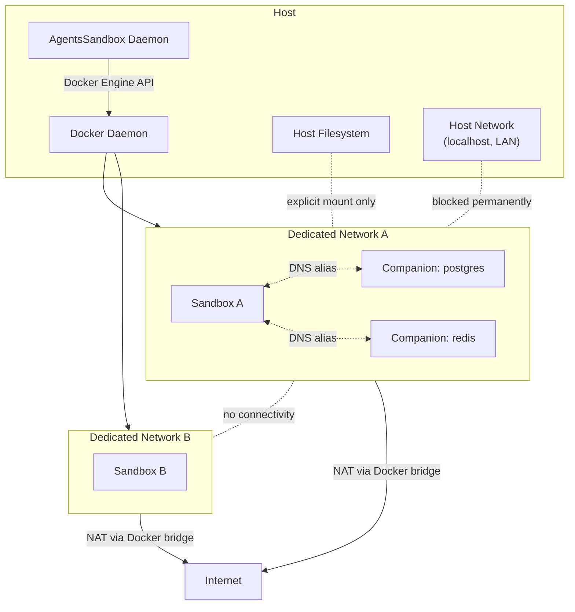

# Isolation and Security

Each sandbox is a Docker container isolated from the host in both **network** and **filesystem**.
- No host network access
- No host filesystem access
- No exceptions.

This document is the security posture reference for `agents-sandbox`.

## Isolation Model

- **Host network blocked — permanently.** Sandboxes cannot reach `localhost`, host services, or the local network. This will never be supported. If the agent needs databases, caches, or other dependencies, declare them as [companion containers](companion_container_guide.md) — they run on the same sandbox network and are reachable by DNS alias.
- **Host filesystem invisible by default.** Only explicitly declared `mounts`, `copies`, and `builtin_tools` may enter the sandbox. Everything else is rejected.
- **Internet fully available.** Outbound traffic is NAT'd via Docker bridge — agents can download packages, call APIs, and clone repos freely.
- **Cross-sandbox isolated.** Each sandbox gets its own dedicated Docker network. Sandboxes cannot reach each other.

## Security Boundaries

| Boundary | Mechanism | Detail |
|----------|-----------|--------|
| **Network** | Dedicated network + host isolation | Outbound internet via NAT; no shared bridge, no host network, no Docker socket exposure. Sandboxes are isolated from each other. Companion containers join the same sandbox network. **Linux**: an nftables rule in the `DOCKER-USER` chain drops all traffic from each sandbox subnet to any host-local address (fib destination addrtype LOCAL), blocking access via every host interface. Rules are managed via the `google/nftables` Go library (netlink syscalls, no forked processes). The daemon requires `CAP_NET_ADMIN`. **macOS**: `host.docker.internal` is overridden to `0.0.0.0` via `--add-host`, preventing containers from reaching the macOS host through Docker Desktop's DNS injection. See [Container Dependency Strategy](container_dependency_strategy.md). |
| **Filesystem** | Explicit-only ingress | Only declared `mounts`, `copies`, and `builtin_tools` (host credential and cache mounts like `claude`, `git`, `uv`) enter the sandbox. Symlink sources and path traversal are rejected. See [Container Dependency Strategy](container_dependency_strategy.md). |
| **Process** | Non-root user + init process | `HOST_UID`/`HOST_GID` align container user with host identity. `Init: true` handles signal forwarding and zombie reaping. |
| **Docker access** | Daemon-mediated only | Sandboxes have no Docker socket. All Docker operations go through the daemon's structured API client. |
| **Ownership** | Namespaced labels | Daemon only manages objects under `io.github.1996fanrui.agents-sandbox.*`. User labels are prefixed to prevent collision. See [Sandbox Container Lifecycle](sandbox_container_lifecycle.md). |
| **Cleanup** | Automatic + idempotent | Sandbox delete removes all resources; STOPPED sandboxes exceeding [`runtime.cleanup_ttl`](configuration_reference.md) are auto-deleted. Failed materialization triggers background cleanup. |
