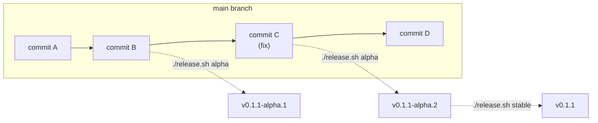

# Release Process

## Release Flow



- **alpha** tags `origin/main` HEAD — includes the latest code.
- **stable** tags the **same commit** as the latest alpha — already verified,
  not affected by new commits on main after the alpha.

All commands run via `scripts/release.sh`. Version numbers are auto-computed
from existing tags — never typed manually. The script uses a temporary git
worktree, so it works from any branch without touching your working directory.

## Artifacts

| Artifact | Distribution | Trigger | Account required |
|----------|-------------|---------|-----------------|
| agboxd / agbox | GitHub Release (linux/darwin × amd64/arm64) | `v*` tag | None — attached to GitHub Release |
| Go SDK | Go module proxy | `v*` tag | None — proxy.golang.org indexes public repos automatically |
| Python SDK | [PyPI](https://pypi.org/project/agents-sandbox-sdk/) | `v*` tag | PyPI (configured via GitHub OIDC in `pypi` environment) |
| Coding runtime image | [GHCR](https://ghcr.io/agents-sandbox/coding-runtime) | `image-coding-v*` tag (independent) | None — uses `GITHUB_TOKEN` |

## Version Auto-Computation

| Current latest | Command | Result |
|----------------|---------|--------|
| *(none)* | `alpha` | `0.1.0-alpha.1` |
| `0.1.0` (stable) | `alpha` | `0.1.1-alpha.1` |
| `0.1.1-alpha.1` | `alpha` | `0.1.1-alpha.2` |
| `0.1.1-alpha.2` | `stable` | `0.1.1` |
| `0.1.1` (stable) | `stable` | `0.1.2` |

`alpha` without arguments always bumps patch. For minor/major, pass the target
base version:

```bash
./scripts/release.sh alpha 0.2.0    # → 0.2.0-alpha.1
./scripts/release.sh alpha 1.0.0    # → 1.0.0-alpha.1
```

## Pre-release Safety

Alpha versions are invisible to normal users in all ecosystems:

- **PyPI**: `pip install agents-sandbox-sdk` skips alpha. Requires explicit
  `==0.1.1a1` or `--pre`.
- **Go modules**: `go get` skips pre-release tags. Requires explicit
  `@v0.1.1-alpha.1`.
- **GitHub**: Alpha releases are marked "Pre-release", not shown as "Latest".

## Container Image Release

Images have an independent release cadence (separate from daemon/SDK):

```bash
git tag image-coding-v1.0.0 && git push origin image-coding-v1.0.0
```

## Error Recovery

If GitHub Release creation fails after the tag was pushed, the script prints:

```bash
git tag -d v0.1.1 && git push origin :refs/tags/v0.1.1
```
