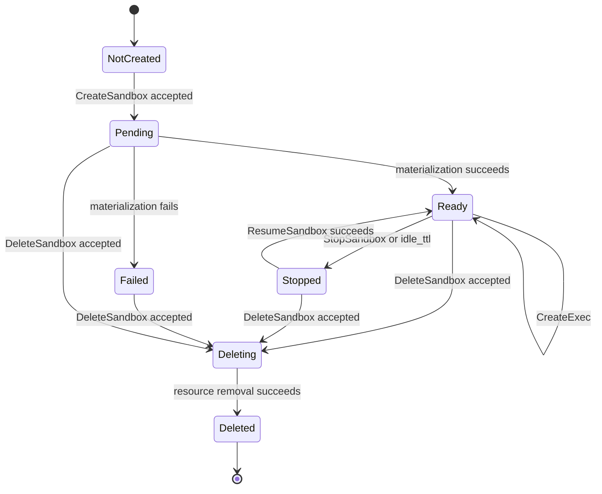
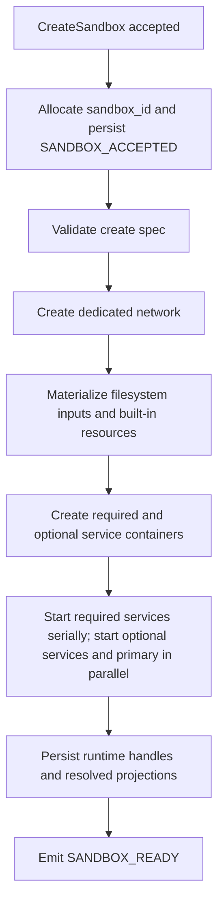
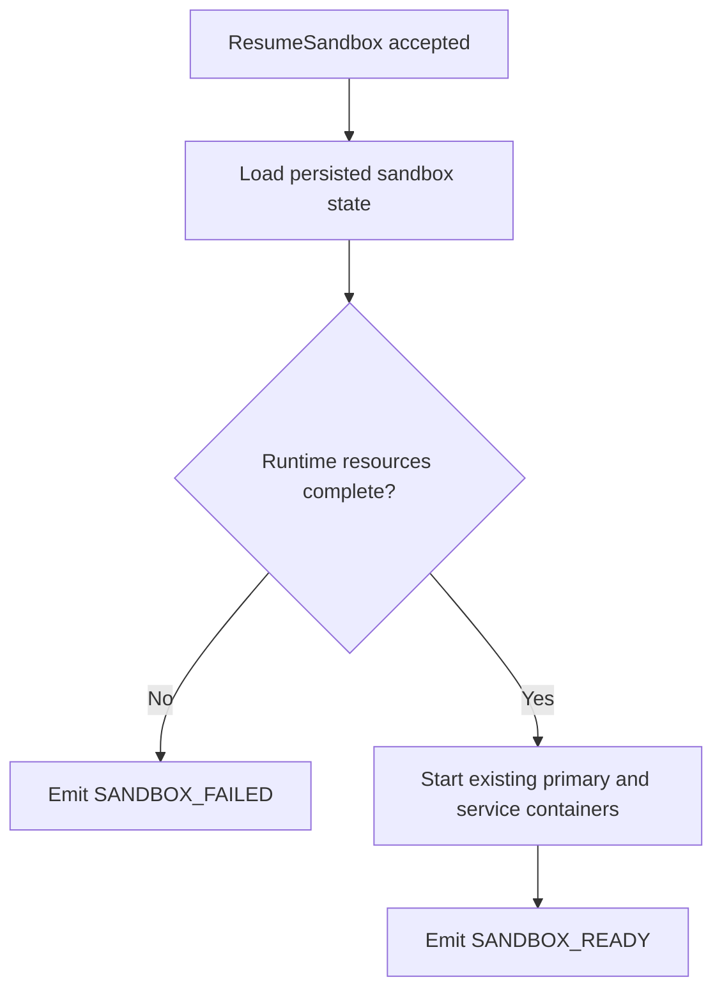
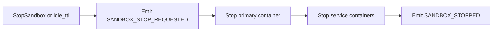
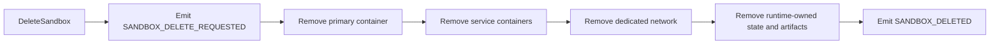

# Sandbox Container Lifecycle

This document describes the runtime lifecycle contract owned by `agents-sandbox`.

The scope is the sandbox runtime itself:

- primary sandbox container
- dedicated sandbox network
- service containers (required and optional)
- runtime event stream
- runtime-owned cleanup and reconciliation

Product-specific lifecycle semantics such as archive states stay outside this repository.

## Runtime Resources

| Resource | Ownership | Notes |
|----------|-----------|-------|
| Primary container | `agents-sandbox` | Main execution target for `CreateExec` |
| Dedicated network | `agents-sandbox` | One network per sandbox; shared bridge and host network are not supported |
| Service containers | `agents-sandbox` | Required and optional services declared via `ServiceSpec`, attached to the same dedicated network |
| In-memory event history | `agents-sandbox` | Source of ordered replayable lifecycle and exec events while the daemon process remains alive |
| Exec output artifacts | `agents-sandbox` | Files created under the configured artifact root |

Docker object labels must use the reverse-DNS namespace `io.github.1996fanrui.agents-sandbox.*`.

## Lifecycle States

The externally visible lifecycle states are `PENDING`, `READY`, `FAILED`, `STOPPED`, `DELETING`, and `DELETED`.

## Lifecycle Event Contract

All lifecycle convergence must be observable through `SubscribeSandboxEvents`.

| Transition | Required Event Sequence |
|------------|-------------------------|
| Create accepted | `SANDBOX_ACCEPTED` |
| Materialization in progress | `SANDBOX_PREPARING` |
| Required service becomes usable | `SANDBOX_SERVICE_READY` |
| Optional service fails | `SANDBOX_SERVICE_FAILED` |
| Create or resume succeeds | `SANDBOX_READY` |
| Create, resume, stop, or delete fails | `SANDBOX_FAILED` |
| Stop begins | `SANDBOX_STOP_REQUESTED` |
| Stop completes | `SANDBOX_STOPPED` |
| Delete begins | `SANDBOX_DELETE_REQUESTED` |
| Delete completes | `SANDBOX_DELETED` |

Idle-stop behavior is part of the same contract. When the daemon stops a sandbox because `runtime.idle_ttl` expired, it must emit `SANDBOX_STOP_REQUESTED(reason=idle_ttl)` and then `SANDBOX_STOPPED`.

Exec lifecycle is part of the same event stream:

- `CreateExec` is the only public exec-starting RPC.
- A successful request allocates `exec_id`, starts the runtime exec asynchronously, and emits `EXEC_STARTED`.
- Terminal states are reported as `EXEC_FINISHED`, `EXEC_FAILED`, or `EXEC_CANCELLED`.
- Internal audit action reasons and strategies remain daemon-owned and must not appear in the public RPC or event schema.

## Event Replay

For one `sandbox_id`:

- the literal `from_cursor="0"` must replay the full ordered event history since sandbox creation
- non-zero cursors must be daemon-issued cursors from the same sandbox stream
- clients must treat `cursor` and `sequence` as the ordering source of truth

The current implementation keeps this event history in daemon memory. A daemon restart resets replay history for still-running sandboxes.

## Create Path

Create-path rules:

- `CreateSandbox` returns immediately after the request is accepted and the daemon has assigned `sandbox_id`.
- The daemon owns actual materialization; the caller must not infer readiness from the RPC response alone.
- The daemon must fail fast on invalid `mounts`, invalid `copies`, unknown `builtin_resources`, invalid service declarations, or unsafe artifact targets.
- The daemon must return a specific error code when a caller-provided `sandbox_id` duplicates an existing active sandbox.

## Resume Path

`ResumeSandbox` only resumes an already created sandbox. It does not accept the original create spec again.

Resume-path rules:

- Missing runtime parts are treated as runtime corruption and must fail fast.
- The daemon must not silently recreate a partially missing sandbox from request-time assumptions.
- Resume keeps runtime identity stable; it does not create a replacement `sandbox_id`.

## Stop and Delete

Delete-path rules:

- Delete is asynchronous and immediately acknowledged.
- Cleanup removes runtime-owned Docker resources and runtime-owned filesystem state.
- Product-owned metadata cleanup is outside the scope of this repository.

## Reconciliation

The daemon owns runtime reconciliation for resources under its namespace.

It must be able to detect and converge:

- idle sandboxes eligible for stop
- runtime resources left behind after failed materialization
- orphaned service containers without a valid parent sandbox
- dedicated networks without live runtime membership

Reconciliation must use structured audit logs and explicit action reasons and strategies.
