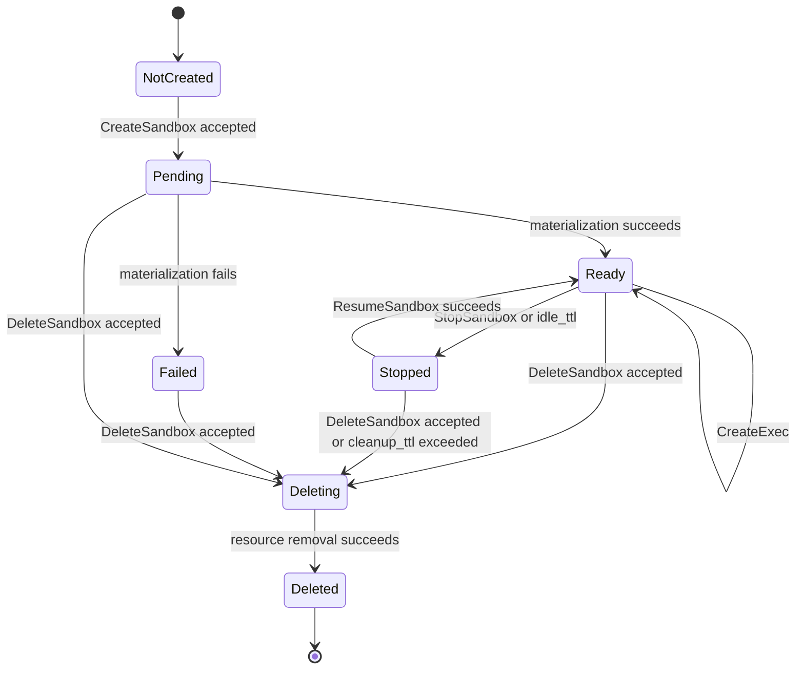
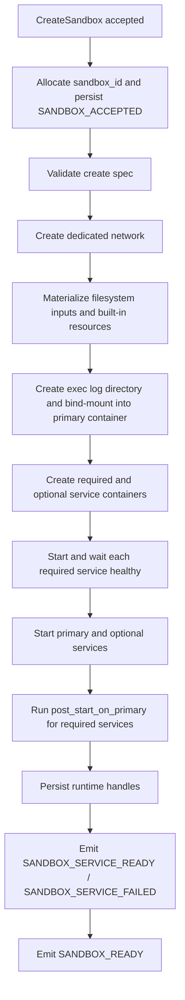
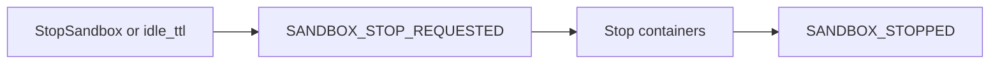
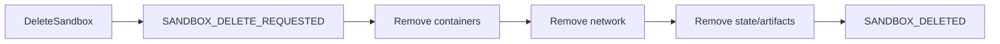

# Sandbox Container Lifecycle

This document describes the runtime lifecycle contract owned by `agents-sandbox`: primary sandbox container, dedicated network, service containers, runtime event stream, exec output redirection, and cleanup/reconciliation.

## Runtime Resources

| Resource | Notes |
|----------|-------|
| Primary container | Main execution target for `CreateExec` |
| Dedicated network | One per sandbox; shared bridge and host network are not supported |
| Service containers | Required and optional services declared via `ServiceSpec`, on the same network |
| Persistent event history | Stored in bbolt; lifecycle and exec events survive daemon restart until retention cleanup |
| Exec output artifacts | Files under the configured artifact root |
| Exec log bind-mount | `{ArtifactOutputRoot}/{sandbox_id}/` → `/var/log/agents-sandbox/` (rw); each exec writes `{exec_id}.stdout.log` and `{exec_id}.stderr.log` |

Docker object labels use the reverse-DNS namespace `io.github.1996fanrui.agents-sandbox.*`. User-defined sandbox labels are propagated with the prefix `io.github.1996fanrui.agents-sandbox.user.<key>`. Historical `sandbox_id` and `exec_id` values are reserved in a persistent registry before accepting create operations, preventing accidental ID reuse after daemon restart.

## Lifecycle States

The externally visible states are `PENDING`, `READY`, `FAILED`, `STOPPED`, `DELETING`, and `DELETED`.

## Lifecycle Event Contract

All lifecycle convergence must be observable through `SubscribeSandboxEvents`. The daemon guarantees monotonic `sequence` numbers per sandbox, and daemon-issued event sequences serve as the authoritative ordering source of truth.

| Transition | Event(s) |
|------------|----------|
| Create accepted | `SANDBOX_ACCEPTED` |
| Materialization in progress | `SANDBOX_PREPARING` |
| Required service ready | `SANDBOX_SERVICE_READY` |
| Optional service fails | `SANDBOX_SERVICE_FAILED` |
| Create or resume succeeds | `SANDBOX_READY` |
| Create/resume/stop/delete fails | `SANDBOX_FAILED` |

The `SANDBOX_FAILED` event's `error_code` and `error_message` from `SandboxPhaseDetails` are projected onto `SandboxHandle`, and `state_changed_at` records the timestamp of each state transition. This allows any read path (`GetSandbox`, `ListSandboxes`) to return failure context without event subscription.

| Stop begins | `SANDBOX_STOP_REQUESTED` |
| Stop completes | `SANDBOX_STOPPED` |
| Delete begins | `SANDBOX_DELETE_REQUESTED` |
| Delete completes | `SANDBOX_DELETED` |

Idle-stop is detected by the `cleanupLoop` periodic scan, which checks all READY sandboxes against their effective idle TTL. The effective idle TTL is `CreateSpec.idle_ttl` when set, falling back to the global `runtime.idle_ttl`. A per-sandbox value of `0` disables idle stop for that sandbox regardless of the global setting; a non-nil per-sandbox value overrides the global threshold. If no exec history exists for a sandbox, the sandbox creation time is used as the idle reference. Idle-stop emits `SANDBOX_STOP_REQUESTED(reason=idle_ttl)` then `SANDBOX_STOPPED`.

Exec lifecycle events: `EXEC_STARTED` on successful `CreateExec`; terminal states `EXEC_FINISHED`, `EXEC_FAILED`, or `EXEC_CANCELLED`. `GetExec().exec.last_event_sequence` lets clients join the exec snapshot to the sandbox event stream without a race. Internal audit action reasons remain daemon-owned and must not appear in the public RPC or event schema.

## Exec Output Redirection

Exec stdout and stderr are redirected inside the container to bind-mounted host files at `{ArtifactOutputRoot}/{sandbox_id}/{exec_id}.stdout.log` / `.stderr.log`. The daemon carries zero I/O buffer per exec; `CreateExecResponse` returns host-side log paths so callers can read output independently. This design keeps the daemon out of the I/O hot path and keeps exec output durable across daemon restarts.

## Event Replay and Retention

For one `sandbox_id`:
- `from_sequence=0` replays the full ordered event history since creation
- non-zero anchors must be daemon-issued event sequences from the same sandbox stream
- stale anchors beyond the retained stream fail with `OUT_OF_RANGE` and reason `SANDBOX_EVENT_SEQUENCE_EXPIRED`

On restart, the daemon loads all persisted state, reconciles with Docker container inspect results, and rebuilds operational sandbox records (see [Daemon State Management](daemon_state_management.md) for the full recovery contract). STOPPED sandboxes that have exceeded `runtime.cleanup_ttl` are automatically deleted: Docker resources (containers, network) are removed and the sandbox record is purged from the database. Deleted sandbox event streams remain queryable until `runtime.cleanup_ttl` expires, after which cleanup removes the retained history.

## Create Path

Create-path rules:
- `CreateSandbox` returns immediately after acceptance; the caller must not infer readiness from the response alone.
- The daemon must fail fast on invalid mounts, copies, unknown builtin_tools, invalid service declarations, or unsafe artifact targets. Duplicate `sandbox_id` returns a specific error code.
- Optional services only report initial create/start result in V1; not restarted or runtime-monitored after readiness.
- If materialization fails after resources exist, cleanup continues on a daemon-owned background context with bounded timeout.

## Resume Path

`ResumeSandbox` only resumes an already created sandbox; it does not accept the original create spec again.

Resume-path rules:
- Missing runtime parts are treated as runtime corruption and must fail fast.
- The daemon must not silently recreate a partially missing sandbox.
- Resume keeps runtime identity stable.

## Stop and Delete

- Delete is asynchronous and immediately acknowledged. Stop and delete continue on daemon-owned background contexts.
- Cleanup uses structured Docker Engine API calls with idempotent not-found handling.
- STOPPED sandboxes that have exceeded `runtime.cleanup_ttl` are automatically deleted by the `cleanupLoop`: Docker resources are removed and the sandbox record is purged from the database.
- After `SANDBOX_DELETED`, the daemon retains the event stream for `runtime.cleanup_ttl` before removing retained history.

## Reconciliation

The daemon owns runtime reconciliation for resources under its namespace: idle sandboxes eligible for stop, resources left after failed materialization, orphaned service containers, and dedicated networks without live runtime membership. Reconciliation uses structured audit logs and explicit action reasons, deriving decisions from structured Docker metadata and recorded runtime state.
