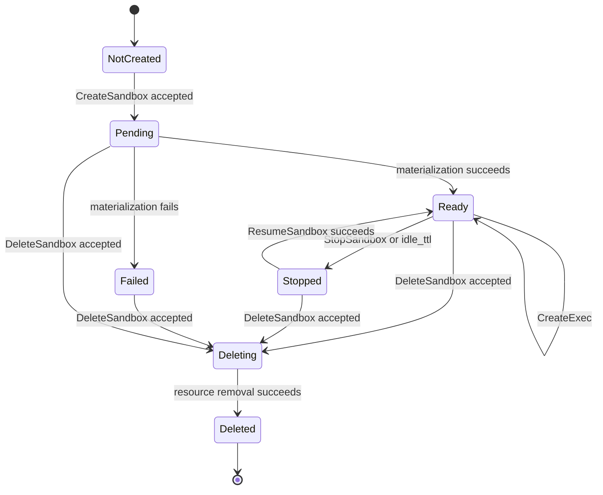
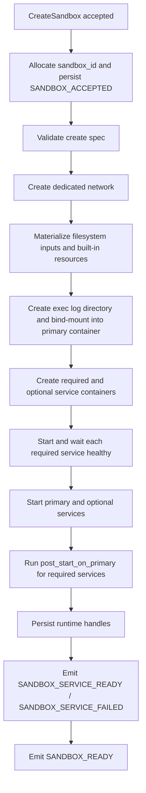
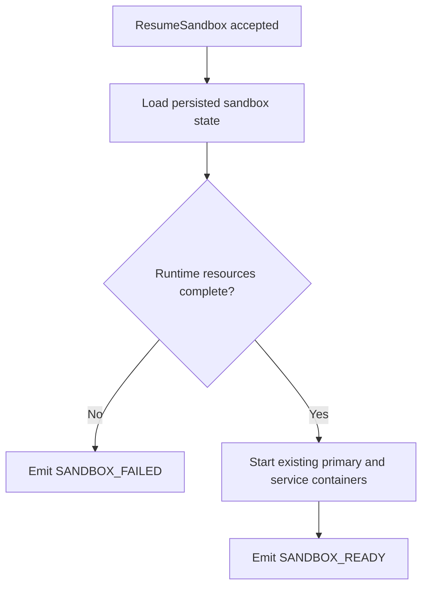
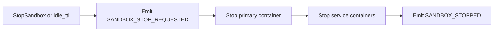
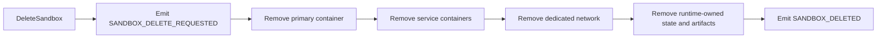

# Sandbox Container Lifecycle

This document describes the runtime lifecycle contract owned by `agents-sandbox`.

The scope is the sandbox runtime itself:

- primary sandbox container
- dedicated sandbox network
- service containers (required and optional)
- runtime event stream
- runtime-owned cleanup and reconciliation

Product-specific lifecycle semantics such as archive states stay outside this repository.

## Runtime Resources

| Resource | Ownership | Notes |
|----------|-----------|-------|
| Primary container | `agents-sandbox` | Main execution target for `CreateExec` |
| Dedicated network | `agents-sandbox` | One network per sandbox; shared bridge and host network are not supported |
| Service containers | `agents-sandbox` | Required and optional services declared via `ServiceSpec`, attached to the same dedicated network |
| Persistent event history | `agents-sandbox` | Stored in bbolt so lifecycle and exec events survive daemon restart until retention cleanup removes deleted streams |
| Exec output artifacts | `agents-sandbox` | Files created under the configured artifact root |
| Exec log bind-mount | `agents-sandbox` | Bind-mounts `{ArtifactOutputRoot}/{sandbox_id}/` to `/var/log/agents-sandbox/` (read-write) in primary container; each exec writes `{exec_id}.stdout.log` and `{exec_id}.stderr.log` |

Docker object labels must use the reverse-DNS namespace `io.github.1996fanrui.agents-sandbox.*`.
User-defined sandbox labels are propagated to the dedicated network, primary container, and service containers with the user namespace prefix `io.github.1996fanrui.agents-sandbox.user.<key>`.

## Lifecycle States

The externally visible lifecycle states are `PENDING`, `READY`, `FAILED`, `STOPPED`, `DELETING`, and `DELETED`.

## Lifecycle Event Contract

All lifecycle convergence must be observable through `SubscribeSandboxEvents`.

| Transition | Required Event Sequence |
|------------|-------------------------|
| Create accepted | `SANDBOX_ACCEPTED` |
| Materialization in progress | `SANDBOX_PREPARING` |
| Required service becomes usable | `SANDBOX_SERVICE_READY` |
| Optional service fails | `SANDBOX_SERVICE_FAILED` |
| Create or resume succeeds | `SANDBOX_READY` |
| Create, resume, stop, or delete fails | `SANDBOX_FAILED` |
| Stop begins | `SANDBOX_STOP_REQUESTED` |
| Stop completes | `SANDBOX_STOPPED` |
| Delete begins | `SANDBOX_DELETE_REQUESTED` |
| Delete completes | `SANDBOX_DELETED` |

Idle-stop behavior is part of the same contract. When the daemon stops a sandbox because `runtime.idle_ttl` expired, it must emit `SANDBOX_STOP_REQUESTED(reason=idle_ttl)` and then `SANDBOX_STOPPED`.

Exec lifecycle is part of the same event stream:

- `CreateExec` is the only public exec-starting RPC.
- A successful request allocates `exec_id`, starts the runtime exec asynchronously, and emits `EXEC_STARTED`.
- Terminal states are reported as `EXEC_FINISHED`, `EXEC_FAILED`, or `EXEC_CANCELLED`.
- `GetExec().exec.last_event_sequence` must let clients join the authoritative exec snapshot to the same sandbox event stream without a race.
- Internal audit action reasons and strategies remain daemon-owned and must not appear in the public RPC or event schema.

## Event Replay

For one `sandbox_id`:

- the literal `from_sequence=0` must replay the full ordered event history since sandbox creation
- non-zero sequence anchors must be daemon-issued event sequences from the same sandbox stream
- clients must treat event sequences as the ordering source of truth
- stale sequence anchors beyond the retained stream must fail with `OUT_OF_RANGE` and reason `SANDBOX_EVENT_SEQUENCE_EXPIRED`

The daemon persists event history, sandbox configs, and exec configs in bbolt. On restart, it loads all persisted state, reconciles with Docker container inspect results, and rebuilds fully operational sandbox records. READY sandboxes with running containers remain READY; READY sandboxes with exited or missing containers become FAILED; STOPPED sandboxes with existing containers stay STOPPED; PENDING and DELETING sandboxes are resolved to FAILED and DELETED respectively. Restored sandboxes support all operations without restriction. Deleted sandbox streams remain queryable until `runtime.event_retention_ttl` expires, after which cleanup removes the retained history.

## Create Path

Create-path rules:

- `CreateSandbox` returns immediately after the request is accepted and the daemon has assigned `sandbox_id`.
- The daemon owns actual materialization; the caller must not infer readiness from the RPC response alone.
- The daemon must fail fast on invalid `mounts`, invalid `copies`, unknown `builtin_resources`, invalid service declarations, or unsafe artifact targets.
- The daemon must return a specific error code when a caller-provided `sandbox_id` duplicates an existing active sandbox.
- Required services must each pass their healthcheck before the sandbox reaches `READY`.
- Optional services only report their initial create/start result in V1; they are not restarted or runtime-monitored after readiness is reached.
- If materialization fails after runtime resources already exist, cleanup continues on a daemon-owned background context with a bounded timeout instead of depending on the initiating request lifetime.

## Resume Path

`ResumeSandbox` only resumes an already created sandbox. It does not accept the original create spec again.

Resume-path rules:

- Missing runtime parts are treated as runtime corruption and must fail fast.
- The daemon must not silently recreate a partially missing sandbox from request-time assumptions.
- Resume keeps runtime identity stable; it does not create a replacement `sandbox_id`.

## Stop and Delete

Delete-path rules:

- Delete is asynchronous and immediately acknowledged.
- Stop and delete continue on daemon-owned background contexts, so teardown is not cancelled when the initiating RPC has already returned.
- Cleanup removes runtime-owned Docker resources and runtime-owned filesystem state through structured Docker Engine API calls with idempotent not-found handling.
- After `SANDBOX_DELETED`, the daemon retains the event stream for `runtime.event_retention_ttl` before cleanup removes the retained history.
- Product-owned metadata cleanup is outside the scope of this repository.

## Reconciliation

The daemon owns runtime reconciliation for resources under its namespace.

It must be able to detect and converge:

- idle sandboxes eligible for stop
- runtime resources left behind after failed materialization
- orphaned service containers without a valid parent sandbox
- dedicated networks without live runtime membership

Reconciliation must use structured audit logs and explicit action reasons and strategies.

Runtime cleanup and reconciliation decisions must derive from structured Docker metadata and the daemon's recorded runtime state, not from parsing human-oriented Docker CLI output.
