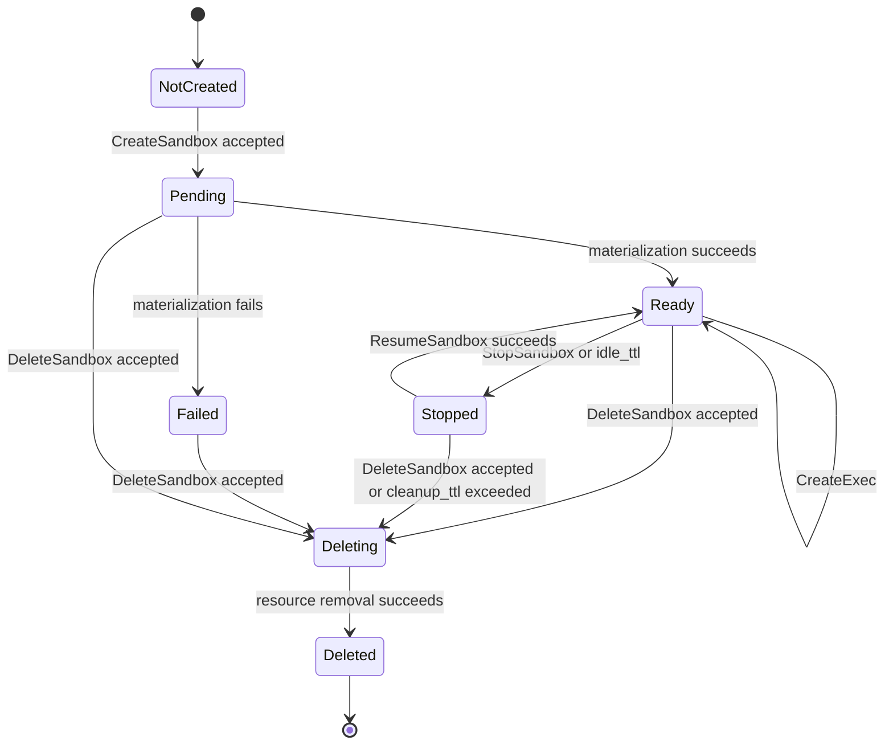
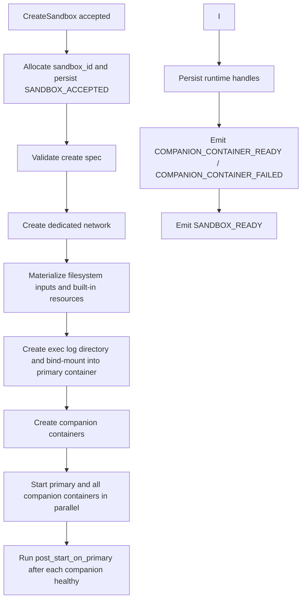
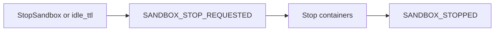
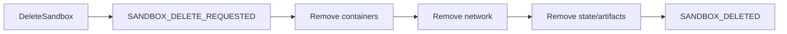

# Sandbox Container Lifecycle

This document describes the runtime lifecycle contract owned by `agents-sandbox`: primary sandbox container, dedicated network, companion containers, runtime event stream, exec output redirection, and cleanup/reconciliation.

## Runtime Resources

| Resource | Notes |
|----------|-------|
| Primary container | Runs the service process as its primary command (under tini) |
| Dedicated network | One per sandbox; shared bridge and host network are not supported. On Linux, nftables rules block new sandbox-originated host traffic (applied on create, re-applied on daemon restart recovery, removed on delete) without blocking established replies for declared host-initiated localhost port mappings. On macOS, `host.docker.internal` is overridden to `0.0.0.0` via `--add-host`. |
| Companion containers | Declared via `CompanionContainerSpec`, on the same network |
| Persistent event history | Stored in bbolt; lifecycle and exec events survive daemon restart until retention cleanup |
| Exec output artifacts | Files under the configured artifact root |
| Exec log bind-mount | `{ArtifactOutputRoot}/{sandbox_id}/` → `/var/log/agents-sandbox/` (rw); each exec writes `{exec_id}.stdout.log` and `{exec_id}.stderr.log` |

Docker object labels use the reverse-DNS namespace `io.github.1996fanrui.agents-sandbox.*`. User-defined sandbox labels are propagated with the prefix `io.github.1996fanrui.agents-sandbox.user.<key>`. Historical `sandbox_id` and `exec_id` values are reserved in a persistent registry before accepting create operations, preventing accidental ID reuse after daemon restart.

## CLI Agent Modes

The agent commands (`agbox claude`, `agbox codex`, `agbox openclaw`,
`agbox paseo`, and `agbox agent --command "..."`) support two modes:

- **Interactive** (`--mode interactive`, default): Attaches a TTY to the agent process. The CLI deletes the sandbox on exit. Uses `idle_ttl=10d` as a safety net.
- **Long-running** (`--mode long-running`): Creates the sandbox and waits for it to become READY, then detaches. The container primary command (declared in configYaml or overridden via `--command`) runs as the service process under tini. Uses `idle_ttl=0` (disable idle stop). The sandbox must be managed manually via `agbox sandbox stop/delete`.

In long-running mode, if sandbox setup fails before READY, the sandbox is automatically cleaned up.

## Primary Container Main Process

The primary container is launched with `HostConfig.Init: true`, so Docker injects `docker-init` (tini) as the literal PID 1 inside the container. tini `exec`s the image `ENTRYPOINT` plus `CMD` argv, which means the image's `entrypoint.sh` runs as tini's immediate child and performs UID/GID setup before `exec gosu "$HOST_UID:$HOST_GID" "$@"`. The final `exec` replaces the shell with the user command (the `command` field from the sandbox request, or the daemon's built-in sleep-loop default when `command` is omitted), and that user process becomes the container's main process under tini.

Docker's lifetime rule still applies: when the container's main process exits, the container exits (tini propagates the child exit code to Docker). Callers that set `command` must therefore supply a long-lived / long-running process — a short-lived command makes the primary container exit immediately and leaves the sandbox unusable until it is restarted. See [Configuration Reference: Primary container command](configuration_reference.md#primary-container-command) for the full contract.

## Lifecycle States

The externally visible states are `PENDING`, `READY`, `FAILED`, `STOPPED`, `DELETING`, and `DELETED`.

## Lifecycle Event Contract

All lifecycle convergence must be observable through `SubscribeSandboxEvents`. The daemon guarantees monotonic `sequence` numbers per sandbox, and daemon-issued event sequences serve as the authoritative ordering source of truth.

| Transition | Event(s) |
|------------|----------|
| Create accepted | `SANDBOX_ACCEPTED` |
| Materialization in progress | `SANDBOX_PREPARING` |
| Companion container ready | `COMPANION_CONTAINER_READY` |
| Companion container fails | `COMPANION_CONTAINER_FAILED` |
| Create or resume succeeds | `SANDBOX_READY` |
| Create/resume/stop/delete fails | `SANDBOX_FAILED` |

The `SANDBOX_FAILED` event's `error_code` and `error_message` from `SandboxPhaseDetails` are projected onto `SandboxHandle`, and `state_changed_at` records the timestamp of each state transition. This allows any read path (`GetSandbox`, `ListSandboxes`) to return failure context without event subscription.

| Stop begins | `SANDBOX_STOP_REQUESTED` |
| Stop completes | `SANDBOX_STOPPED` |
| Delete begins | `SANDBOX_DELETE_REQUESTED` |
| Delete completes | `SANDBOX_DELETED` |

Idle-stop is detected by the `cleanupLoop` periodic scan, which checks all READY sandboxes against their effective idle TTL. The effective idle TTL is `CreateSpec.idle_ttl` when set, falling back to the global `runtime.idle_ttl`. A per-sandbox value of `0` disables idle stop for that sandbox regardless of the global setting; a non-nil per-sandbox value overrides the global threshold. If no exec history exists for a sandbox, the sandbox creation time is used as the idle reference. Idle-stop emits `SANDBOX_STOP_REQUESTED(reason=idle_ttl)` then `SANDBOX_STOPPED`.

Exec lifecycle events: `EXEC_STARTED` on successful `CreateExec`; terminal states `EXEC_FINISHED`, `EXEC_FAILED`, or `EXEC_CANCELLED`. `GetExec().exec.last_event_sequence` lets clients join the exec snapshot to the sandbox event stream without a race. Internal audit action reasons remain daemon-owned and must not appear in the public RPC or event schema.

## Exec Output Redirection

Exec stdout and stderr are redirected inside the container to bind-mounted host files at `{ArtifactOutputRoot}/{sandbox_id}/{exec_id}.stdout.log` / `.stderr.log`. The daemon carries zero I/O buffer per exec; `CreateExecResponse` returns host-side log paths so callers can read output independently. This design keeps the daemon out of the I/O hot path and keeps exec output durable across daemon restarts.

## Event Replay and Retention

For one `sandbox_id`:
- `from_sequence=0` replays the full ordered event history since creation
- non-zero anchors must be daemon-issued event sequences from the same sandbox stream
- stale anchors beyond the retained stream fail with `OUT_OF_RANGE` and reason `SANDBOX_EVENT_SEQUENCE_EXPIRED`

On restart, the daemon loads all persisted state, reconciles with Docker container inspect results, and rebuilds operational sandbox records (see [Daemon State Management](daemon_state_management.md) for the full recovery contract). STOPPED sandboxes that have exceeded `runtime.cleanup_ttl` are automatically deleted: Docker resources (containers, network) are removed and the sandbox record is purged from the database. Deleted sandbox event streams remain queryable until `runtime.cleanup_ttl` expires, after which cleanup removes the retained history.

## Create Path

Create-path rules:
- `CreateSandbox` returns immediately after acceptance; the caller must not infer readiness from the response alone.
- The daemon must fail fast on invalid mounts, copies, unknown builtin_tools, invalid companion container declarations, or unsafe artifact targets. Duplicate `sandbox_id` returns a specific error code.
- If materialization fails after resources exist, cleanup continues on a daemon-owned background context with bounded timeout.
- Create-failure cleanup removes the dedicated network and any partially created containers.

## Resume Path

`ResumeSandbox` only resumes an already created sandbox; it does not accept the original create spec again.

Resume-path rules:
- Missing runtime parts are treated as runtime corruption and must fail fast.
- The daemon must not silently recreate a partially missing sandbox.
- Resume keeps runtime identity stable.

## Stop and Delete

- Delete is asynchronous and immediately acknowledged. Stop and delete continue on daemon-owned background contexts.
- Cleanup uses structured Docker Engine API calls with idempotent not-found handling.
- STOPPED sandboxes that have exceeded `runtime.cleanup_ttl` are automatically deleted by the `cleanupLoop`: Docker resources are removed and the sandbox record is purged from the database.
- After `SANDBOX_DELETED`, the daemon retains the event stream for `runtime.cleanup_ttl` before removing retained history.
- Containers are created with Docker `RestartPolicy=unless-stopped`, so previously-running sandboxes come back automatically after a host or Docker daemon restart, while sandboxes stopped via `agbox sandbox stop` remain stopped until `ResumeSandbox`.

## Per-container Resource Limits

Resource limits are expressed once per container (primary and each companion independently) and sent straight to Docker as native HostConfig fields. Each container carries its own three limits; there is no sandbox-wide resource pool and the daemon keeps no resource-limit state of its own.

For each container:

- `cpu_limit` → `HostConfig.NanoCPUs` (= millicores × 1_000_000).
- `memory_limit` → `HostConfig.Memory`; `HostConfig.MemorySwap` is left at Docker's default.
- `disk_limit` → `HostConfig.StorageOpt["size"]` as a plain decimal byte count.

Any of the three limits can be omitted independently; an omitted limit means Docker applies no enforcement for that dimension on that container. There is no sandbox-wide resource pool — two containers in the same sandbox do not compete against a shared budget, and one container hitting its limit does not constrain its siblings. See [Configuration Reference: Resource Limits Prerequisites](configuration_reference.md#resource-limits-prerequisites) for the host-side prerequisites that each key requires.

## Reconciliation

The daemon owns runtime reconciliation for resources under its namespace: idle sandboxes eligible for stop, resources left after failed materialization, orphaned companion containers, and dedicated networks without live runtime membership. Reconciliation uses structured audit logs and explicit action reasons, deriving decisions from structured Docker metadata and recorded runtime state.

### Crashloop Detection: 5-Minute Non-Running Window with 30-Second Running Guard

Only `READY` sandboxes are reconciled; `FAILED`, `STOPPED`, `DELETING`, and `DELETED` sandboxes are skipped. A **15-second ticker** drives periodic reconciliation; container lifecycle events (die, oom) provide more timely triggers but do not bypass the window evaluation.

Per-container state (`notRunningSince`, `runningSince`) is maintained in memory and reset on daemon restart (Category C — see [Daemon State Management](daemon_state_management.md)).

**Decision rules** (applied to both primary and companion containers):

1. **Inspect error** — log warn; no state change (conservative: short network blip must not fail a sandbox).
2. **`!Exists`** — immediate fail: no grace period for a container that has been fully removed.
3. **`Paused`** — clear both `notRunningSince` and `runningSince`; pause is user-controlled and must not count toward crashloop.
4. **`Running`** — set `runningSince` if nil; if running continuously for ≥ 30 seconds (Running guard), clear both timers (stable, window reset). Short Running bursts (< 30s) do not clear `notRunningSince`.
5. **Non-Running** (`Exists && !Running && !Paused`) — clear `runningSince`; set `notRunningSince` if nil; if `now − notRunningSince > 5 minutes`, trigger fail decision. OOMKilled containers follow the same 5-minute window (error code `CONTAINER_OOM` instead of `CONTAINER_CRASHLOOP`).

**Primary vs. companion action difference:**

| Trigger | Primary | Companion |
|---------|---------|-----------|
| `!Exists` (immediate) | `SANDBOX_FAILED` + `StopSandbox` | `COMPANION_CONTAINER_FAILED` |
| 5-minute window expired | `SANDBOX_FAILED` + `StopSandbox` | `COMPANION_CONTAINER_FAILED` |

When the primary container fails, the daemon calls `runtimeBackend.StopSandbox` asynchronously to stop all sandbox containers (primary + companions), preventing `unless-stopped` from restarting them. Containers and networks are **not deleted** — they are retained for post-mortem diagnosis and remain cleanable via `agbox sandbox delete`. If `StopSandbox` fails, a warn log is recorded; no additional event is emitted (the sandbox is already `FAILED`).

**Daemon restart behavior:** When a `READY` sandbox has an exited primary container (`Exists=true, Running=false`) on daemon restart, the daemon keeps the sandbox `READY` and initializes `notRunningSince = now`, giving the container a fresh 5-minute grace period rather than failing immediately. This accommodates `unless-stopped` restart backoff (100ms–60s) across daemon restarts.
